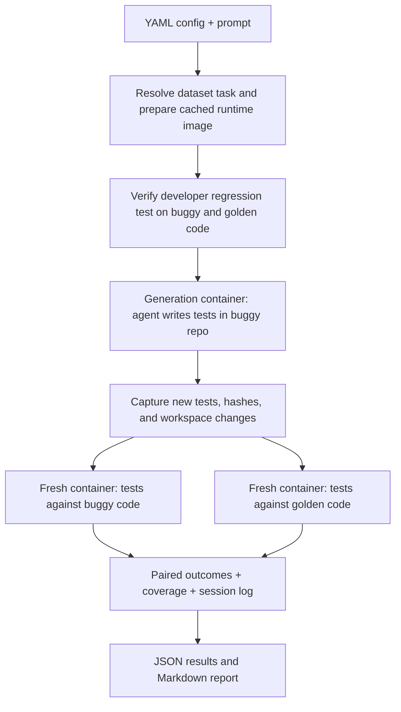

# Oracle Bench

## Quickstart

Requires Python 3.11+, [uv](https://docs.astral.sh/uv/), Docker with a running
Linux daemon, and a credential for the provider selected in the configuration.
The host CLI currently runs on Unix (Linux/macOS) to enforce pull/build deadlines.

Copy the local secrets file and add your API keys:

```sh
# Create the local secrets file if you don't already have one.
[ -f .env ] || cp .env.example .env
```

Run from the repository root:

```sh
uv sync --extra dataset --extra dev

uv run oracle-bench run configs/smoke-claude.yaml

# Run an explicit, resumable set of experiments and aggregate their results.
uv run oracle-bench batch configs/batches/initial-haiku.yaml
```

## About

Oracle Bench tests how well coding agents generate unit tests when the code they see already contains a bug. An agent receives a buggy repository and a request to write tests, without being given the issue description or fix. The benchmark then runs the same generated tests against buggy and fixed (golden) versions, collecting paired pass/fail outcomes and coverage.

80% of this repo is just coordinating containers and managing data in and out of them.

## Architecture / pipeline

The host orchestrates Docker containers, captures generated tests, and scores results. Each generation container includes the repository, its Python environment, and the selected agent harness. Evaluation uses fresh containers so both versions receive the same captured tests.



The private regression check must pass before generation starts. The agent runs as a non-root user with the selected credential; the host Docker socket and private run artifacts are not mounted. Generation has network access, while evaluation does not. Git-history sanitization and internet-use auditing are not implemented yet.

Only new tests and fixtures under `oracle_tests/` are evaluated. Changes outside that directory are recorded as violations and make the results diagnostic. Existing repository tests can remain visible or be hidden through configuration.

## Usage

### CLI

```sh
# Generate tests and evaluate both code versions.
uv run oracle-bench run configs/smoke-claude.yaml

# Rerun saved tests in fresh containers; no agent or model calls.
uv run oracle-bench evaluate runs/<run-id>

# Rebuild the report and readable session log from saved data.
uv run oracle-bench report runs/<run-id>

# Continue pending or failed jobs without repeating completed jobs.
uv run oracle-bench batch --resume batches/<batch-id>

uv run oracle-bench --help
```

`evaluate` archives previous evaluation results and requires the saved runtime image to remain available locally. Neither `evaluate` nor `report` needs credentials. CLI exit codes are `0` for success, `1` for setup/configuration errors, `2` for recorded agent/execution/submission problems, and `130` for interruption. Failing test assertions are valid benchmark outcomes and do not by themselves make the CLI fail.

### Configuration and credentials

Choose a sample configuration, or copy one and edit it:

| Config                                                 | Harness / provider             | Credential           |
| ------------------------------------------------------ | ------------------------------ | -------------------- |
| [smoke-claude.yaml](configs/smoke-claude.yaml)         | Claude Code / Anthropic, Haiku | `ANTHROPIC_API_KEY`  |
| [smoke.yaml](configs/smoke.yaml)                       | Codex / OpenAI                 | `OPENAI_API_KEY`     |
| [smoke-openrouter.yaml](configs/smoke-openrouter.yaml) | Codex / OpenRouter, free model | `OPENROUTER_API_KEY` |

The YAML interface defines:

| Section  | Controls                                                                    |
| -------- | --------------------------------------------------------------------------- |
| `source` | Source adapter and instance ID                                              |
| `agent`  | Agent harness, provider, model, and generation limits                       |
| `task`   | Prompt file, generated-test directory, and `existing_tests: keep` or `hide` |
| `limits` | Setup/evaluation timeouts and container CPU/memory limits                   |
| `output` | Run-directory location                                                      |

See the [complete configuration reference](docs/configuration.md) for every
setting, default, validation rule, and harness-specific behavior.

File paths are relative to the YAML file. The SWE-bench adapter derives the
prepared image, repository runtime, existing-test paths, coverage settings, and
private reference targets from the instance. `hide` applies the adapter's
repository-specific test removal rules; both evaluation versions use the same
visibility setting. The private reference check retains the original tests.

### Results

| Artifact in `runs/<run-id>/`                   | Contents                                                  |
| ---------------------------------------------- | --------------------------------------------------------- |
| `report.md` / `results.json`                   | Paired outcomes, coverage, and run status                 |
| `agent/session.log`                            | Readable prompt, messages, tool calls/results, and errors |
| `agent/trace.jsonl` / `agent/result.json`      | Raw agent events and reported usage/cost                  |
| `generated/files/` / `generated/manifest.json` | Captured tests, hashes, and violations                    |
| `buggy/` / `golden/`                           | Per-test results, coverage, and execution logs            |
| `config.resolved.yaml` / `runtime.json`        | Saved configuration and exact runtime image               |

See the [complete results and artifacts reference](docs/results.md) for the full
directory layout, JSON fields, logs, evaluation artifacts, and reevaluation
behavior.

### Development

The package lives in `src/oracle_bench/`: `cli.py` and `config.py` define the interface,
`run.py` orchestrates the pipeline, `container/` integrates the Docker Python SDK,
`docker/` contains image recipes, and `workspace.py` prepares repositories.
`datasets/` resolves tasks, `harnesses/` launches agents, and `runners/`,
`evaluate.py`, and `report.py` handle scoring and reporting. See
[container development](docs/containers.md) for the API and standalone image builds.

## Tests

```sh
# Local suite: no Docker or API keys required.
uv run pytest -q

# Formatting and lint checks.
uv run ruff check src tests
uv run ruff format --check src tests

# Docker integration checks after a smoke run has prepared its image.
ORACLE_BENCH_SMOKE_RUN=runs/<run-id> uv run pytest -q -m docker
```

Local tests cover configuration, credentials, agent traces, artifacts, pytest outcomes, coverage, and reports. Docker checks use handwritten probes on the Requests task to exercise all four matrix cells and both test-visibility settings. They do not call a model.

If Docker reports a socket permission error after you've joined the `docker` group, run `newgrp docker` in your terminal or log out and back in, then check `docker info` again.
