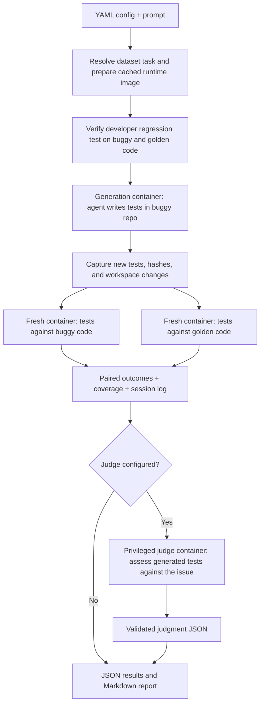

# Oracle Bench

## Quickstart

Requires Python 3.11+, [uv](https://docs.astral.sh/uv/), Docker with a running
Linux daemon, and a credential for the provider selected in the configuration.
The host CLI currently runs on Unix (Linux/macOS) to enforce pull/build deadlines.

Copy the local secrets file and add your API keys:

```sh
# Create the local secrets file if you don't already have one.
[ -f .env ] || cp .env.example .env
```

Run from the repository root:

```sh
uv sync --extra dataset --extra dev

uv run oracle-bench run configs/smoke.yaml
```

## About

Oracle Bench tests how well coding agents generate unit tests when the code they see already contains a bug. An agent receives a buggy repository and a request to write tests, without being given the issue description or fix. The benchmark then runs the same generated tests against buggy and fixed (golden) versions, collecting paired pass/fail outcomes and coverage.

80% of this repo is just coordinating containers and managing data in and out of them.

## Architecture / pipeline

The host orchestrates Docker containers, captures generated tests, and scores results. Each generation container includes the repository, its Python environment, and the selected agent harness. Evaluation uses fresh containers so both versions receive the same captured tests.



## Usage

### CLI

```sh
# Generate tests and evaluate both code versions.
uv run oracle-bench run configs/smoke.yaml

# Rerun saved tests in fresh containers; no agent or model calls.
uv run oracle-bench evaluate runs/<run-id>

# Run the configured semantic judge after paired evaluation.
uv run oracle-bench judge runs/<run-id>

# Compare saved human and LLM ratings and select a calibration sample.
uv run oracle-bench agreement batches/<batch-id> --sample-per-stratum 8

# Rebuild the report and readable session log from saved data.
uv run oracle-bench report runs/<run-id>

# Continue pending or failed jobs without repeating completed jobs.
uv run oracle-bench batch --resume batches/<batch-id>

uv run oracle-bench --help
```

### Human judgment

Create a workspace for a saved run:

```sh
uv run oracle-bench judge-workspace create runs/<run-id> --rater rater_01
```

In VS Code, run **Dev Containers: Attach to Running Container** and select the
container printed by the command. Open `/oracle-judge/human-judge.code-workspace`,
follow `HUMAN_INSTRUCTIONS.md`, and save the completed judgment to the requested
output path.

Back on the host, collect the judgment and remove the container:

```sh
uv run oracle-bench judge-workspace collect <container-name>
uv run oracle-bench judge-workspace remove <container-name>
```

### Configuration and credentials

Choose a sample configuration, or copy one and edit it.

The smoke configuration uses Claude Haiku through OpenRouter for generation and
judging. Set `OPENROUTER_API_KEY` in `.env` before running it.

The YAML interface defines:

| Section  | Controls                                                                     |
| -------- | ---------------------------------------------------------------------------- |
| `source` | Source adapter and instance ID                                               |
| `agent`  | Claude Code, Codex, or OpenCode harness; provider, model, one stopping limit |
| `judge`  | Optional semantic-judge rubric, harness, model, and stopping limit           |
| `task`   | Repository/localized scope, prompt, generated directory, and test visibility |
| `limits` | Setup/evaluation timeouts and container CPU/memory limits                    |
| `output` | Run-directory location                                                       |

See the [complete configuration reference](docs/configuration.md) for every
setting, default, validation rule, and harness-specific behavior.

### Results

| Artifact in `runs/<run-id>/` | Contents                                                  |
| ---------------------------- | --------------------------------------------------------- |
| `report.md`                  | Human-readable run summary and artifact links             |
| `inputs/`                    | Frozen prompt, resolved config, and private instance      |
| `image-build/`               | Runtime image, build inputs, provenance, and logs         |
| `reference-check/`           | Private fail-on-buggy/pass-on-golden validation           |
| `generation/`                | Agent command, transcript, raw events, and workspace diff |
| `submission/`                | Captured generated tests, hashes, and violations          |
| `evaluation/`                | Paired result plus buggy and golden executions            |
| `judge/`                     | Judge workspace manifest, model evidence, and judgment    |

See the [complete results and artifacts reference](docs/results.md) for the full
directory layout, JSON fields, logs, evaluation artifacts, and reevaluation
behavior.

### Development

The package lives in `src/oracle_bench/` and is organized by pipeline stage:
`instance/` resolves a task, `container/images.py` prepares the runtime image,
`generation.py` runs the agent and freezes its submission, `evaluation/` executes
that submission on both revisions, `judge/` annotates it, and `report.py` renders
the result. `run.py` calls each stage once; `cli.py` and `config.py` define the
interface, `container/` integrates the Docker Python SDK, `harnesses/` launches
agent CLIs, and `repository.py` prepares checkouts. See
[container development](docs/containers.md) for the API and standalone image builds.

## Tests

```sh
# Local suite: no Docker or API keys required.
uv run pytest -q

# Formatting and lint checks.
uv run ruff check src tests
uv run ruff format --check src tests

# Docker integration checks after a smoke run has prepared its image.
ORACLE_BENCH_SMOKE_RUN=runs/<run-id> uv run pytest -q -m docker
```

Local tests cover configuration, credentials, agent traces, artifacts, pytest outcomes, coverage, and reports. Docker checks use handwritten probes on the Requests task to exercise all four matrix cells and both test-visibility settings. They do not call a model.

If Docker reports a socket permission error after you've joined the `docker` group, run `newgrp docker` in your terminal or log out and back in, then check `docker info` again.

## Misc notes:

- The private regression check must pass before generation starts.
- The agent runs as a non-root user with the selected credential; the host Docker socket and private run artifacts are not mounted.
- Generation, reference, and evaluation containers have outbound network access so repository tests run under a consistent environment.
- Git-history sanitization and internet-use auditing are not implemented yet.
- Only new tests and fixtures under `oracle_tests/` are evaluated. Changes outside that directory are recorded as violations and make the results diagnostic. Existing repository tests can remain visible or be hidden through configuration.
