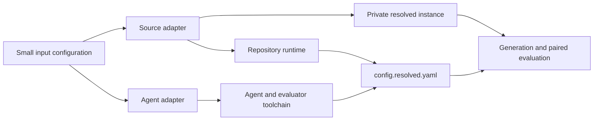

# Configuration reference

Oracle Bench runs one benchmark instance from a YAML file:

```sh
uv run oracle-bench run configs/smoke.yaml
```

Multiple independent configurations can be coordinated by a batch manifest:

```yaml
name: initial-nex
jobs:
  - config: ../initial-nex/astropy.yaml
  - config: ../initial-nex/flask.yaml
execution:
  concurrency: 1
  continue_on_error: true
output: ../../batches
```

Run it with `oracle-bench batch <manifest>`. Paths are relative to the manifest.
`configs/batches/initial-nex.yaml` mirrors the ten-task initial Haiku batch with
OpenCode and the free `nex-agi/nex-n2.5-pro:free` OpenRouter model. It has no
turn limit; the per-job wall-time remains the runaway-process bound.
All job configurations are validated and hashed before execution. The initial batch
runner is sequential, isolates job failures, writes aggregate JSON and Markdown after
every job, and can continue with `oracle-bench batch --resume <batch-directory>`.

The benchmark-run interface has six top-level sections: `source`, `agent`, optional
`judge`, `task`, `limits`, and `output`. Only `source.instance`, `agent.model`,
and `task.prompt` are required. Unknown settings are rejected, including the
removed `dataset`, `environment`, and `harness` sections from the original
schema.

## Minimal configuration

```yaml
source:
  instance: psf__requests-1142

agent:
  model: gpt-5.4

task:
  prompt: ../prompts/agent/unit-tests.md
```

For a localized SWE-bench assignment:

```yaml
task:
  prompt: ../prompts/agent/localized-tests.md
  scope: localized
  existing_tests: hide_all
```

For a Claude run:

```yaml
source:
  instance: psf__requests-1142

agent:
  harness: claude
  model: haiku
  auth: api_key
  limit:
    kind: wall_seconds
    value: 300

task:
  prompt: ../prompts/agent/smoke-tests.md
```

Paths in the input file are resolved relative to that file, not the shell's
current directory.

Configuration uses Pydantic schemas: unknown fields and incorrect scalar types
are rejected at loading time. Harness defaults are resolved with the agent schema;
host path resolution is a separate step. Runtime layout checks occur when source
adapter data meets the experiment configuration. Configurations are not
versioned: a file written for an earlier revision fails to load rather than being
partially interpreted.

## Resolution model

The input file contains experiment choices. Source adapters and Oracle Bench's
internal toolchain supply execution details:



For SWE-bench, Oracle Bench derives the prepared instance image, repository
workdir, Python interpreter, rebuild command, coverage roots, import probes, and
private reference targets. It also pins the dataset revision, SWE-bench image
convention, Node image, agent CLI, pytest, and coverage versions. These values
are recorded for reproducibility but do not need to be repeated in each input
file.

## `source`

The source selects one SWE-bench Verified record by default.

### `source.instance`

- **Type:** string
- **Required:** yes

The SWE-bench `instance_id`, such as `psf__requests-1142`. Oracle Bench requires
exactly one matching record and derives the official prepared image name from
this ID.

### `source.kind`

- **Type:** `swebench`
- **Default:** `swebench`

Selects the source adapter. This discriminator allows later `git` and additional
dataset adapters without adding their fields to the SWE-bench interface. Other
kinds are not implemented yet.

### `source.dataset`

- **Type:** dataset alias
- **Default:** `verified`

`lite` resolves to `princeton-nlp/SWE-bench_Lite`; `verified` resolves to
`princeton-nlp/SWE-bench_Verified`.

### `source.revision`

- **Type:** 40-character commit SHA
- **Default:** Oracle Bench's pinned revision for the selected dataset

Advanced reproducibility override for the Hugging Face dataset repository. This
is not the buggy repository commit; `base_commit` comes from the selected record.
Ordinary configurations should omit it. The resolved value and record checksum
are saved with every run.

### `source.split`

- **Type:** string
- **Default:** `test`

Dataset split searched for `source.instance`. Ordinary SWE-bench Verified runs use
the default.

### `source.record`

- **Type:** host path or null
- **Default:** null

Optional local SWE-bench JSON record for offline runs and fixtures. When set,
Oracle Bench does not contact Hugging Face. The record must contain nonempty
`instance_id`, `repo`, `base_commit`, `patch`, and `test_patch` strings. Its
instance ID must match `source.instance`, and `base_commit` must be an immutable
commit SHA. `FAIL_TO_PASS` must be a list of test IDs or a JSON-encoded list.

The resolved record, golden repair, and reference tests are saved privately in
`instance.json` and are never exposed to the generation agent.

## `agent`

This section selects the agent being evaluated. Supported combinations are:

| `harness` | `provider` | Credential |
|---|---|---|
| `codex` | `openrouter` (default) | `OPENROUTER_API_KEY` |
| `codex` | `openai` | `OPENAI_API_KEY` |
| `claude` | `openrouter` (default) | `OPENROUTER_API_KEY` |
| `claude` | `anthropic` | `CLAUDE_CODE_OAUTH_TOKEN` or `ANTHROPIC_API_KEY` |
| `opencode` | `openrouter` (default) | `OPENROUTER_API_KEY` |

Credential names are derived from the provider and authentication mode. Claude
Code uses OpenRouter's Anthropic-compatible endpoint, Codex uses its
Responses-compatible endpoint, and OpenCode uses its built-in OpenRouter
provider. Secret values belong in the environment or gitignored `.env`, never
in YAML.

### `agent.model`

- **Type:** string
- **Required:** yes

Model identifier passed to the selected CLI. Use a full provider model ID when
exact model identity matters.

### `agent.harness`

- **Type:** `codex`, `claude`, or `opencode`
- **Default:** `codex`

Agent CLI launched inside the generation container. OpenCode currently supports
OpenRouter only in Oracle Bench.

### `agent.provider`

- **Type:** `openai`, `openrouter`, or `anthropic`
- **Default:** `openrouter` for every harness

Codex supports OpenRouter/OpenAI, Claude supports OpenRouter/Anthropic, and
OpenCode supports OpenRouter. Name a native provider explicitly to use it.

### `agent.limit`

- **Type:** `{kind: wall_seconds, value: <positive number>}`
- **Default:** `{kind: wall_seconds, value: 300}`

Maximum elapsed time for the model turn. The container deadline applies the same
policy to Codex, Claude Code, and OpenCode. Files created before a timeout are
still captured and evaluated. `judge.limit` has the same shape and default.

### `agent.multi_agent`

- **Type:** boolean
- **Default:** `true`

Whether the evaluated harness may use its built-in subagent features. Judge
subagents are always disabled, so `judge.multi_agent` accepts only `false`.

### `agent.auth`

- **Type:** `oauth` or `api_key`
- **Default:** `oauth`
- **Applies to:** Claude

`oauth` reads `CLAUDE_CODE_OAUTH_TOKEN`; `api_key` reads `ANTHROPIC_API_KEY`.
Codex credentials are selected from its provider.

## `judge`

The optional judge section configures a privileged evaluation of the generated
tests. When this section is present, the normal `run` lifecycle invokes the judge
after paired evaluation. `oracle-bench judge runs/<run-id>` independently reruns
the same stage from saved evidence. Omit the section to preserve the ordinary
generation and evaluation lifecycle without a judge model call.

```yaml
judge:
  rubric: ../prompts/judge/generated-test-evaluation-rubric.md
  instructions: ../prompts/judge/generated-test-instructions.md
  harness: claude
  provider: anthropic
  model: haiku
  auth: api_key
  limit:
    kind: wall_seconds
    value: 300
```

A configured run requires the judge credential before generation starts, so an
unset judge credential fails the run before it spends anything.

`judge.rubric` and `judge.instructions` are both required and resolved relative
to the configuration file. Their exact bytes are copied to `judge/rubric.md` and
`judge/instructions.md` when a run resolves, so a later `oracle-bench judge` uses
the same text the original run did.

`judge.instructions` tells the judge what the workspace contains and what to
return; the rubric that follows defines the labels. `$root` in the instructions
is replaced with the workspace path inside the container. The two are joined, in
that order, into `judge/prompt.md`, which is the exact text sent to the model.

Every other field has the same meaning and supported values as the corresponding
agent field, except `multi_agent`, which is always `false`.

## `task`

### `task.prompt`

- **Type:** host path
- **Required:** yes

Public prompt template given to the agent. Prompt files own all agent-facing
instructions and may use these resolved environment variables:

- `${generated_dir}`: repository-relative directory where new tests are allowed.
- `${project_python}`: absolute path to the resolved project Python.
- `${workdir}`: repository root inside the container.
- `${test_target}`: sanitized production file or enclosing symbol derived from
  the private repair for a localized task.

Oracle Bench substitutes those variables and freezes the exact delivered text as
`prompt.txt`. Use `$$` when the prompt needs a literal dollar sign.

### `task.scope`

- **Type:** `localized` or `repository`
- **Default:** `repository`

`localized` bounds a SWE-bench assignment to production files and, when patch
context identifies one unambiguously, an enclosing class or function. The prompt
receives this location through `${test_target}`; repair contents, changed lines,
reference tests, and expected behavior remain private. `repository` supplies no
issue-derived location and is intended for small projects where repository-wide
test generation is meaningful.

### `task.existing_tests`

- **Type:** `keep` or `hide_all`
- **Default:** `hide_all`

Whether existing repository tests remain visible to the agent and available in
the final evaluation workspace. Evaluation still executes only generated tests.
`hide_all` removes explicitly declared test files and pytest-style test modules
under repository-specific test directories supplied by the SWE-bench adapter.
Package initializers, fixtures, runners, helpers, and data remain because some
projects import that support code at runtime. Private reference validation always
retains all existing tests. Regardless of this setting, generation receives a
fresh one-commit Git repository, so earlier revisions cannot expose removed tests
or other historical task evidence.

### `task.generated_dir`

- **Type:** repository-relative path
- **Default:** `oracle_tests`

The only directory where the agent may add tests and fixtures. It cannot be
absolute, traverse upward, refer to `.git`, or overlap the production source
roots resolved by the source adapter.

## `limits`

The whole section is optional.

| Setting | Default | Meaning |
|---|---:|---|
| `evaluation_seconds` | `600` | Limit for each buggy or golden pytest execution |
| `setup_seconds` | `1800` | Limit for each image/setup operation |
| `memory` | `4g` | Docker memory limit |
| `cpus` | `2` | Docker CPU allocation |

Numeric limits must be positive. Docker validates the memory string when the
container starts.

## `output`

- **Type:** host directory path
- **Default:** `runs`

Parent directory for timestamped run directories.

## Resolved-only sections

`config.resolved.yaml` adds `runtime` and `toolchain` sections. They contain generated execution details rather than experiment input:

- `runtime`: source image, platform, workdir, Python, rebuild command, coverage
  roots, import probes, and repository-specific existing-test globs.
- `toolchain`: Node image plus pinned Codex, Claude Code, OpenCode, pytest, and
  coverage versions. CLI versions come only from this locked toolchain; a run
  cannot pin its own. Change `docker/package.json` and its lockfile to upgrade a
  harness.

The resolved file also expands source, agent, task, and resource defaults and is
the configuration consumed by `oracle-bench evaluate`. Edit the small input file
for new runs; treat the resolved file as a run lock and evidence artifact.

## Future Git sources

The `source.kind` boundary is designed for an eventual repository-pair adapter:

```yaml
source:
  kind: git
  repository: https://github.com/example/project.git
  buggy_revision: 012345...
  golden_revision: abcdef...
```

This syntax is illustrative and is not accepted yet. A paired Git source will
also need a prepared image, repository-owned container recipe, or explicit
runtime manifest, plus a private reference witness. A single repository revision
can support generation and coverage later, but cannot produce the paired
buggy/golden matrix by itself.

## Standalone task classification

Task classification has its own YAML contract because it is a one-time annotation
process, not a generation run. Invoke it with:

```sh
uv run oracle-bench classify configs/classification/example.yaml
```

Its top-level fields are `source`, `classifier`, `rubric`, `limits`, and `output`.
`source` uses the schema above. `classifier` accepts the same harness, provider,
authentication, model, and wall-time settings as `judge`, and always sets
`multi_agent: false`. `rubric` is the task-classification rubric path. `limits`
controls image setup and container memory/CPU limits; evaluation time is unused.
`output` defaults to `classifications`.

The complete runnable example is
[`configs/classification/example.yaml`](../configs/classification/example.yaml).
Paths are resolved relative to that YAML file. Runtime and toolchain settings are
generated and frozen in the attempt rather than accepted as input.

## Sample configurations

- [`configs/smoke.yaml`](../configs/smoke.yaml): Claude Code generation and
  judging with Haiku through OpenRouter. Both stages have five-minute limits.
- [`configs/batches/openrouter-three-harnesses.yaml`](../configs/batches/openrouter-three-harnesses.yaml):
  one localized Requests task each for Opus/Claude Code, GPT-5 Mini/Codex, and
  Nex-N2.5 Pro/OpenCode, all routed through OpenRouter.
