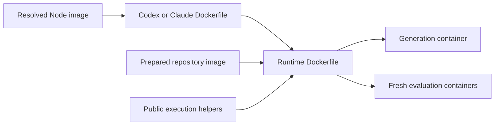

# Container and configuration revision

Status: implemented, with local tests passing. Real Docker build/exec/paired
evaluation checks remain unverified because the daemon is unavailable in the
implementation environment. See [containers.md](containers.md) for the resulting
interface and the documented Unix host deadline requirement.

This document supersedes the earlier conversation's custom
Docker engine and generic container-task framework proposals. It refines the
existing Stage 1 implementation; it does not expand benchmark scope.

## Intended result

Use checked-in Dockerfiles and the official Docker SDK for Python to build and
run containers. Keep a small application interface for lifecycle, execution, and
artifact transfer. Workflow code should describe repository preparation,
generation, and evaluation without assembling Docker commands or shell scripts.

Readability is an acceptance criterion. Functions should have cohesive purposes,
related logic should live together, and comments should explain decisions and
ordering constraints. Prefer existing library capabilities and simple functions
over building another general-purpose execution framework.

The preliminary custom engine/task scaffolding has been replaced with SDK
integration. The old `containers.py` implementation has been removed after
migrating its callers. Pydantic now owns configuration field validation.

## 1. Establish the library integration

Add the official `docker` dependency using uv. Start with the SDK's own client,
image, container, and exception objects. Do not introduce a second DockerEngine
API, backend registry, command class hierarchy, or generic ContainerTask system.

Before migrating callers, exercise these integration details with a small
non-model Docker check when a suitable local image is available:

- Build a checked-in multistage Dockerfile with arguments and a local parent
  image; preserve build output on both success and failure.
- Execute a command with separate streamed stdout/stderr and prompt input.
- Enforce a process deadline, terminate descendants, and collect partial output.
- Transfer a file and directory through the SDK's archive methods.

SDK HTTP timeouts are not process deadlines. Keep process termination explicit
and distinguish a timeout from a crash or ordinary nonzero exit. Confirm the
SDK build API works with the installed daemon; modern BuildKit/buildx behavior
must not be assumed equivalent to the SDK build API. If this requires a build
CLI adapter, keep that exception local and document the concrete reason.

## 2. Make image definitions readable and reusable

Package the Dockerfiles under `src/oracle_bench/docker/` so installed distributions
can build images as well as repository checkouts. Add a short README containing
ordinary Docker build examples, required arguments, and supported base-image
assumptions.



Use separate small Codex and Claude Dockerfiles with pinned versions supplied by
build arguments. The runtime Dockerfile inherits the prepared repository image,
copies the harness runtime, installs evaluator dependencies, creates the oracle
user, and installs public helpers outside the repository checkout. Use native
Dockerfile arguments, with no template engine or generated instruction strings.

Keep image preparation in one focused module. Resolve parent images, invoke the
recipes, and record provenance as distinct readable operations. Let Docker cache
layers. If retaining application cache tags, include platform, resolved parent
identities, build arguments, and every relevant context file's content in their
identity; hashing only the Dockerfile would miss helper changes.

Copy only approved build assets into an isolated context. Save recipes, helper
hashes, non-secret arguments, source and final image identities, and raw build
logs. Write build inputs before starting the build so failures remain inspectable.

Document compatibility assumptions such as libc/architecture compatibility for
copied Node binaries and the availability of Python, pip, bash, and useradd.
Arbitrary repository environment construction remains deferred.

## 3. Introduce a small managed container interface

Use a context manager that owns an SDK Container and removes it on normal exit,
errors, and interruption. Handle creation/start failures without leaving an
untracked container. Keep the original failure visible if cleanup also fails.

Expose only operations needed by real callers: run a command, upload an explicit
file or directory, and download explicit artifacts. Use SDK-shaped arguments
and a small execution result where benchmark status requires it. Keep container
IDs and SDK transport details inside this module.

Centralize generation, reference, and evaluation policies. Generation permits
networking and runs the agent as oracle; reference and evaluation disable
networking. Setup privileges are explicit. No profile mounts the Docker socket
or the complete host run directory. Resource limits are applied consistently.

Use argv for ordinary commands. Put reusable multiline operations in checked-in
helpers. Keep the source adapter's rebuild shell recipe as an explicit, documented
exception. Collect partial output before removing a timed-out container; account
for child processes that might still mutate the workspace during capture.

Archive handling belongs here because it is transport behavior. Use standard
library facilities and focused extraction rules: reject traversal, unexpected
links and special files in exported submissions, and avoid extracting container
archives indiscriminately into the host. Missing optional artifacts should be
recorded distinctly from transport failures.

## 4. Move domain operations into their proper modules

Move repository preparation out of the Docker module into `workspace.py`.
Use one cohesive RepositoryWorkspace object only if shared state makes the
callers clearer; otherwise use ordinary functions. Document the preparation
order: reset, rebuild, apply test visibility, establish the baseline, and set
ownership. Preserve private reference tests only for reference evaluation.

Workspace code owns reset/rebuild/patch operations. Artifact policy stays in
`artifacts.py`: snapshots, forbidden-change classification, frozen capture, and
checksum verification. The runner owns its settings, execution, and interpretation
of output. Keep golden/reference patches out of generation inputs and images.

Migrate both harnesses to the small container interface. Share the actual repeated
launch/output/redaction behavior while keeping CLI arguments, configuration, and
transcript interpretation in each adapter. Credentials must not appear in saved
arguments, serialized objects, logs, or exception messages. Redact streamed output
before writing it, including secrets spanning chunk boundaries.

Then simplify `run.py` and `evaluate.py` to read as the benchmark workflow. Remove
the old Docker wrappers and obsolete scaffolding after their final caller moves.

## 5. Organize configuration loading

Refactor `config.py` as a separate reviewable change. Evaluate a declarative
schema library such as Pydantic against the current YAML contract before choosing
it. Preserve strict unknown-field handling, intentional scalar types, defaults,
relative-path resolution, and input-versus-resolved-file behavior. Avoid silently
coercing booleans or strings into numeric limits.

The loader should visibly follow four phases: read YAML, parse the input or saved
schema, resolve defaults and paths, and return the typed configuration. Group
agent, source, task, and runtime rules with their respective models. Reserve
custom validators for meaningful cross-field rules, rather than manually walking
every field with isinstance/getattr/regex loops.

Validate external YAML and source-adapter output at their boundaries, then trust
the internal models. Tests establish invariants for code-controlled values.
Retain focused checks where runtime data can escape a path boundary, overwrite
production files, invalidate captured artifacts, or misrepresent execution.
Explain those checks at their boundary instead of duplicating them in callers.

## 6. Preserve saved-run behavior and document the interface

Keep the public CLI and experiment YAML stable. Preserve `runtime.json`'s exact
image identity and the existing result semantics. Add build provenance fields
compatibly where possible; version genuinely incompatible persisted changes.

Old runtime images do not contain the newly installed helpers. Provide an explicit
compatibility path for reevaluating those saved runs, staging only the required
public helper files when necessary. Test this path; do not silently rebuild old
images or substitute a new runtime during reevaluation.

Update README, configuration/results references, package data, and the project
agent guide's code layout. Document how to build a harness/runtime independently
and where repository-specific setup belongs. Add concise module and API docstrings
and comments on non-obvious lifecycle, credential, and preparation decisions.

## 7. Verify behavior and review for readability

Use focused local tests with SDK mocks at the transport boundary. Test behavior
that can regress: timeout and interruption cleanup, partial output collection,
archive safety, credential redaction, profile policies, build failure evidence,
cache invalidation after helper changes, configuration compatibility, and old-run
reevaluation. Retain existing artifact and four-cell result tests. Avoid tests
that merely assert the existence of wrapper methods or mirror implementation.

Run the required local suite and lint/format checks:

```sh
uv run pytest -q
uv run ruff check src tests
uv run ruff format --check src tests
```

When a prepared local runtime is available, run the existing Docker integration
checks and a build/exec/copy smoke check without calling a model. If Docker or the
necessary image is unavailable, report that validation gap explicitly. A paid or
quota-limited model run still requires separate authorization.

Before handoff, read the resulting workflow as a maintainer: operations should
be recognizable, defaults and side effects should be discoverable, and helper
functions should reduce cognitive load. Simplify layers that add navigation
without clarifying behavior. Completion requires both behavioral verification
and this readability review.

## Suggested review units

1. SDK integration and checked-in image recipes, including build provenance.
2. Managed containers and migration of workspace, harness, and evaluator callers.
3. Configuration schemas and organized loading.
4. Compatibility verification, documentation, and final readability pass.

Each unit should leave the repository runnable. Do not migrate all callers onto
an untested abstraction at once.
