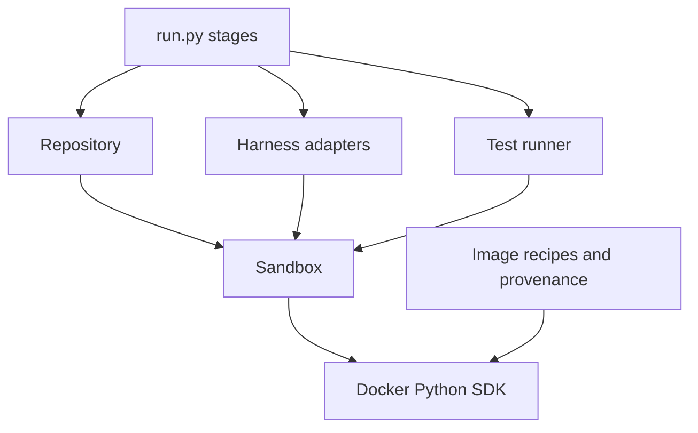

# Container development

Oracle Bench uses the official Docker SDK for Python. Images use the checked-in
[Dockerfiles](../src/oracle_bench/container/docker/README.md); the host container interface
is a small wrapper around an SDK Container. There is no separate Docker engine
abstraction or generic task framework.



## Building and starting

`container/images.py` copies a small allowlist of public assets into separate
harness/runtime build contexts, resolves parents, and builds with the SDK. The
cache identity includes platform, parents, arguments, and context hashes. Build
inputs and raw event logs remain available after failure. No complete run or
repository root is passed as the automatic build context.

The host CLI currently requires a Unix main thread for wall-clock pull/build
deadlines (`SIGALRM`); container execution uses its own process supervisor.
Docker's HTTP timeout alone is not a process or streaming-operation deadline.
Interrupting setup stops the host wait and unwinds the request; inspect Docker
after an interrupted build because daemon-side work may have progressed.

```python
with docker_client() as client:
    image = prepare_image(client, config, run_dir)
    with open_sandbox(client, image, config, Profile.EVALUATION, log) as sandbox:
        workspace = RepositoryWorkspace(sandbox, config)
        workspace.prepare(base_commit, evaluation_dir)
```

Generation, evaluation, reference, and judge profiles use Docker's outbound
bridge network so repository tests see a consistent environment and the judge can
reach its model provider. Interactive human-judge workspaces are named,
long-running containers created with no network and no model credential. The SDK
receives resource limits and `no-new-privileges`, and no host mounts.
Container creation and start are separate so a failed start still gets cleanup.
The client and each container have explicit owners through context managers.

## Executing and transferring files

`sandbox.run(argv, ...)` takes explicit user, timeout, environment, stdin path,
stdout/stderr paths, and log options. Setup uses root; the shared harness launcher
always selects oracle. A public helper opens the prompt as stdin and supervises
the command's process group. It records exit code, elapsed time, and timeout status
separately, so exit 137 is not automatically a timeout. A host watchdog stops the
container if its supervisor or transport stalls.

Output is streamed through credential redaction before being persisted. SDK
exceptions from credential-bearing execution are reported without serializing
their request contents. Only the selected credential enters the exec environment.
After the agent exits, the container is stopped and restarted before capture to
terminate detached descendants as well as ordinary subprocesses.

`upload(source, destination, contents=True)` copies a directory's children.
`download(source, destination, contents=True)` exports a directory's contents.
With the default `contents=False`, download expects one regular file. Container
archives are validated before any host writes, and links/special files and path
traversal are rejected. `required=False` allows a missing artifact; it does not
suppress malformed archives or transport failures.

Container-side logic lives in `container/helpers/` so it is linted, packaged, and
unit-testable on local fixtures. Those helpers are baked into the prepared image.
The judge's helper is uploaded into its container instead: judging reads evidence
produced by a specific image and must run against that image rather than a
rebuilt one. The workspace specification records the uploaded helper's hash.

Workspace reset, rebuild, test visibility, baseline creation, and repair application
belong in `repository.py` and its checked-in helper. Submission classification and
integrity checks remain in `generation.py`. The privileged judge bundle is built in
`judge/workspace.py` rather than by relaxing either of those. Harness-specific
flags, limits, and trace parsing remain in their adapters; shared launch I/O lives
in `harnesses/launch.py`.

## Verification

Local tests mock the SDK transport and run standalone helpers on local fixtures.
They require no daemon, network, or model credentials. With an existing smoke run
and its runtime image, the Docker-marked suite tests the real four-cell Requests
pair and reevaluation. A separate opt-in smoke check exercises build, exec, and
archive transfer on a local runtime without calling a model.
