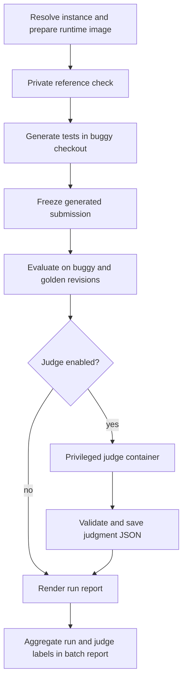
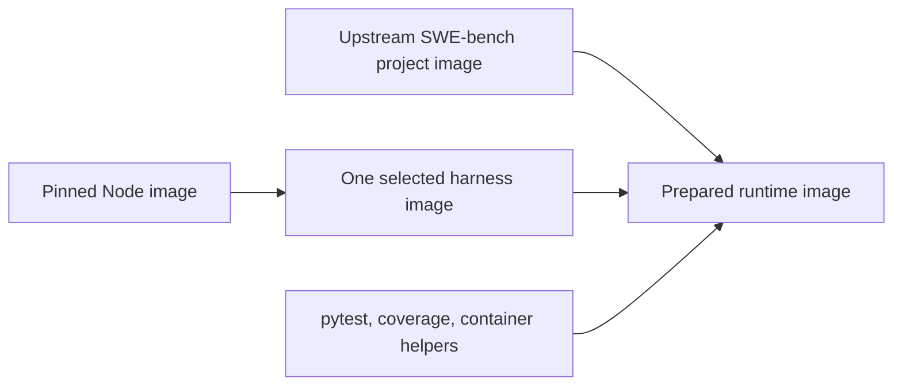
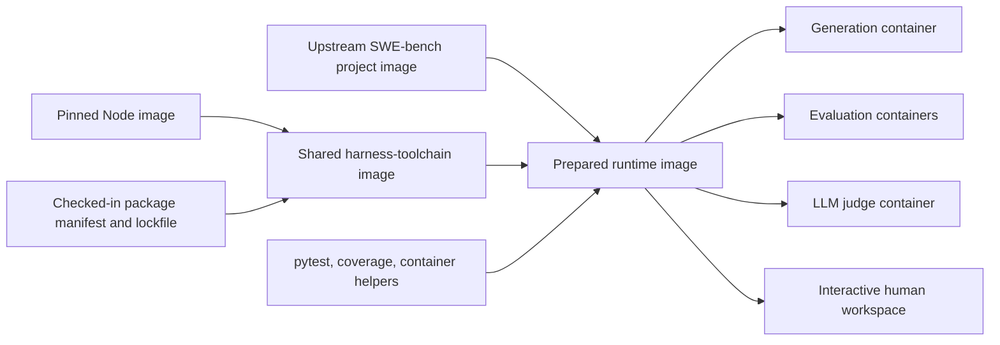

# Generated-test judge implementation plan

## Goal

Add an optional LLM judge after paired test evaluation. The judge receives the
private SWE-bench evidence, both repository versions, the frozen generated
submission, and its execution results. It applies
[`prompts/judge/generated-test-evaluation-rubric.md`](../prompts/judge/generated-test-evaluation-rubric.md)
and returns one validated JSON judgment per run.

This stage answers a different question from the pass/fail matrix. The matrix
records whether a generated test distinguishes the buggy and golden revisions.
The judge records whether the generated submission actually addresses the issue,
uses a relevant trigger, and asserts the intended behavior.

The judge runs only after evaluation artifacts have been written. It is a
privileged analysis stage and must remain separate from test generation: none of
its issue, repair, reference-test, golden-code, or evaluation evidence may become
visible to the generation agent.

## Proposed lifecycle



The judge stage should also be independently rerunnable. A failed or malformed
judgment must not erase valid generation or evaluation results.

## Configuration

Add an optional top-level `judge` section to the run configuration. Reuse the
existing harness/provider vocabulary, but give the judge its own model and
stopping policy. Generation and judging are separate model calls and may use
different providers or harnesses.

```yaml
judge:
  rubric: ../prompts/judge/generated-test-evaluation-rubric.md
  harness: codex
  provider: openai
  model: gpt-5.4-mini
  limit:
    kind: budget_usd
    value: 0.10
```

Recommended defaults:

- judging is disabled when the section is absent, preserving existing configs;
- subagents are always disabled for this bounded classification task;
- `limit` is one discriminated stopping policy rather than three competing
  settings. Its supported kinds can be `budget_usd`, `turns`, or `wall_seconds`,
  but a configuration chooses exactly one. Prefer `budget_usd` for judge runs
  and reject a harness/provider pair that cannot enforce the selected policy;
- keep an internal fixed watchdog as infrastructure protection. It is not a
  user-facing experiment limit and is reported only if it fires;
- require an explicit rubric path so the exact prompt can be frozen with the
  run;
- derive the credential exactly as the generation harness does and never write
  its value to configuration or logs.

The implementation should extract the shared harness fields into a reusable
configuration model while retaining `agent` and `judge` as distinct sections.
Do not make the judge inherit generation settings implicitly; that would make
cost and provenance difficult to interpret.

## Judge image and container

Use a fresh disposable container with a new `JUDGE` profile. Do not reuse a
generation or evaluation container, because those containers are deliberately
destroyed and have different visibility rules.

### Current image hierarchy

The current builder creates two Oracle Bench layers on top of upstream images:



`prepare_contexts()` copies only the Dockerfile for `config.agent.harness`.
`prepare_image()` builds that one harness at `config.agent.version`, then
`runtime.Dockerfile` copies its Node executable and `/opt/oracle-agent` tree into
the project image. Consequently, the prepared runtime is tied to the generation
harness even though the project environment and most Oracle Bench tooling are
otherwise identical.

Judging makes that coupling awkward. A run may generate with Claude Code, judge
with Codex, and later open the same evidence for a human. Building a second
project runtime solely to add another small CLI duplicates orchestration and
creates two image identities for one repository environment.

### Proposed image hierarchy

Replace the three alternative harness-image recipes with one checked-in,
versioned harness-toolchain recipe:



The harness-toolchain image installs Codex, Claude Code, and OpenCode together
under `/opt/oracle-agent`. Their executable names do not conflict, and the
runtime image places their shared `node_modules/.bin` directory on `PATH`. The
project image still supplies the repository, native libraries, and Python
environment. Oracle Bench still adds pytest, coverage, its helpers, and the
non-root `oracle` user in the final runtime layer.

This changes which programs are available in the container, not which harness
runs. Each agent turn still selects exactly one adapter. The adapter constructs
one command, injects only its required credential environment, and records the
selected harness, provider, model, and command.

### Versioning and reproducibility

Treat harness CLI versions as part of the Oracle Bench toolchain rather than a
different image choice for every run:

- check in a package manifest and lockfile containing exact Codex, Claude Code,
  and OpenCode versions;
- install them with the package manager's lockfile-enforcing command rather than
  resolving transitive dependencies during every build;
- record the three requested versions, installed `--version` outputs, lockfile
  hash, Node image digest, harness-toolchain image ID, and final runtime image ID
  in `image-build/images.json`;
- include the manifest, lockfile, Dockerfile, platform, and all version values in
  the content-derived image identity;
- record the selected harness and its observed version again in each generation
  or judge result.

Today `AgentConfig.version` can select one harness version per run. Move those
pins into the resolved toolchain contract. During migration, accept an existing
`agent.version` only when it equals the corresponding pinned toolchain version;
otherwise fail before building with a message explaining how to update the
toolchain lock. Once existing configurations have migrated, remove the
per-agent version field in the next incompatible configuration schema. This
prevents two requested versions of the same executable from silently competing
for one path in the shared image.

Updating any harness version deliberately changes the shared toolchain image
identity. Docker rebuilds that layer once, then reuses it for every repository
image. Prepared project-runtime identities also change because their parent
toolchain changed. That is desirable for experimental provenance: runs using
different CLI toolchains should not claim the same environment. It does mean a
harness upgrade invalidates the prepared-runtime cache for subsequent runs, so
toolchain upgrades should be intentional and infrequent during an experiment.

### Concrete builder changes

The image implementation should change as follows:

1. Replace `docker/agents/{codex,claude,opencode}.Dockerfile` with a shared
   `docker/harnesses.Dockerfile` plus its checked-in package manifest and
   lockfile.
2. Remove the harness argument from `prepare_contexts()`. Always copy the same
   public harness-toolchain build context and the same runtime context.
3. Build one content-addressed `oracle-bench/harnesses:<identity>` image from the
   pinned Node image.
4. Rename the runtime build argument from `AGENT_IMAGE` to `HARNESS_IMAGE` and
   copy Node plus the complete locked harness installation into the upstream
   project image.
5. Change `requested.json` and `images.json` from a single `harness`/`version`
   pair to an `installed_harnesses` mapping, while retaining the selected
   generation and judge harnesses in the resolved run configuration.
6. Keep the final prepared runtime ID as the only image needed by generation,
   reference evaluation, final evaluation, LLM judging, and interactive human
   inspection.

The shared image does not contain task-specific data. Dataset records, issue
text, repairs, reference tests, generated tests, evaluation results, credentials,
and run directories remain runtime uploads to the appropriate disposable
container. Installing all harness packages therefore does not weaken the
generation evidence boundary.

There is one operational consequence: the selected agent process receives a
credential and can execute any program already installed in its container. This
is already a trusted capability of the coding agent—it can execute shell commands
and make network requests—but installing more provider CLIs makes that capability
more obvious. Continue passing only the selected credential to the selected
process, redact it from all output, and record the actual launched command. Human
inspection containers should receive no model credential and can run without
network access.

The combined harness layer will be larger than a single-harness layer. Measure
its compressed size and cold build time during implementation, but prefer the
simpler one-image lifecycle unless those measurements show a material batch
cost. Normal batches should pay the harness installation cost once because the
layer is shared across project images.

Create the judge container only after paired evaluation completes. Give it
ordinary outbound networking for the model call, the same CPU and memory limits
as other agent containers, and run the harness as the non-root `oracle` user.
The host Docker socket and complete host run directory must remain unmounted.
Upload only the explicit judge bundle described below.

## Judge workspace

Present a stable directory layout so the prompt does not need to explain where
every artifact happens to live:

```text
/oracle-judge/
  rubric.md
  instance/
    issue.md
    fix.patch
    reference-tests.patch
    metadata.json
  buggy/                 # base_commit checkout
    <repository files>
    <generated submission>
  golden/                # base_commit + golden patch
    <repository files>
    <generated submission>
  evidence/
    relevance.md
    submission-manifest.json
    workspace.diff
    paired-results.json
    buggy-tests.json
    buggy-output.log
    golden-tests.json
    golden-output.log
```

Prepare the two repository views from one fresh container:

1. Restore `/testbed` to `base_commit` without hiding existing tests. This is the
   buggy view.
2. Create a second Git worktree for the golden view and apply the production
   repair there. A worktree avoids copying the repository's Git object database.
3. Upload the checksum-verified generated submission into both views at the same
   relative paths used during evaluation.
4. Upload the issue, repair, reference-test patch, normalized instance metadata,
   paired results, per-version structured results, and execution logs under
   `/oracle-judge`.
5. Generate `evidence/relevance.md` as a short starting guide containing the
   production files changed by the repair, files changed by the reference-test
   patch, generated-test paths, relevant test IDs, and links to their execution
   results. This guide points the judge toward useful evidence without deciding
   the rubric labels for it.
6. Make all evidence readable by `oracle`. The judge may inspect files and run
   read-only commands. It does not need to rerun the full suite because the saved
   execution evidence is authoritative.

If an upstream image cannot create a second worktree cleanly, fall back to two
explicit repository directory copies inside the disposable container. This is a
container-local compatibility fallback, not a second image build.

The judge bundle is intentionally privileged. Its construction should live in a
new judge module rather than relaxing `RepositoryWorkspace.prepare()` or the
generation upload policy.

Keep the complete buggy and golden checkouts available. Producing partial source
trees would require deciding in advance which transitive code, fixtures, and
configuration matter, and a mistaken slice could change the judgment. The
relevance guide gives the common case a compact path through a large repository.
If judge traces later show that repository exploration dominates cost, evaluate
a derived source bundle as a separate optimization and compare its labels with
the full-checkout condition before adopting it.

## Reproducible human judging

Treat the judge workspace as a reproducible benchmark input, independent of
whether its rater is an LLM or a person. Save a versioned `workspace-spec.json`
that records:

- the prepared image ID and content digest;
- the base commit and hashes of the repair and reference-test patches;
- every uploaded artifact's destination and SHA-256 hash;
- the commands used to create the buggy and golden worktrees;
- the rubric hash and workspace-layout version.

The specification and existing run artifacts are enough to reconstruct the
workspace; do not preserve stopped containers or export large image archives by
default. The recorded image inputs and pinned harness versions should allow the
runtime image to be rebuilt if it is no longer local.

Add a human-workspace command:

```sh
oracle-bench judge-workspace create runs/<run-id> --rater <anonymous-rater-id>
```

It reconstructs the same `/oracle-judge` layout in a named, long-running
container and prints the container name plus the command needed to open a shell.
Because it is an ordinary running container, VS Code can open it through
**Dev Containers: Attach to Running Container**. The command should also support
printing a small generated `.code-workspace` file whose folders are the rubric,
buggy checkout, golden checkout, and evidence directory.

Human mode must be blinded to existing LLM and human judgments so previous labels
cannot anchor the rater. It exposes the common input bundle only. The rater writes
the same rubric JSON schema to `/oracle-judge/output/judgment.json`; a collection
command validates it and stores it under a rater-specific host path:

```text
judge/human/<anonymous-rater-id>/judgment.json
```

Use opaque rater IDs in exported research data and keep any identity mapping
outside the run artifacts. Collection and cleanup should be explicit:

```sh
oracle-bench judge-workspace collect <container-name>
oracle-bench judge-workspace remove <container-name>
```

This workflow supports multiple independent human ratings of the exact same
submission and direct human–human and human–LLM agreement calculations.

## Prompt and harness reuse

Create a small judge prompt around the frozen rubric. It should:

- state that the model is evaluating one generated-test submission;
- name the stable paths above;
- tell the model to inspect the issue, both code versions, generated tests, and
  execution evidence;
- tell it not to modify the repositories or rerun broad test suites;
- include the rubric verbatim;
- require exactly one JSON object matching the rubric's output schema and no
  Markdown fence.

Generalize the current harness launch path so a caller supplies:

- the harness configuration;
- the prompt file;
- the working directory;
- the artifact directory (`generation/` or `judge/agent/`);
- whether a last-message file is required.

Keep harness-specific command construction in the existing Codex, Claude, and
OpenCode adapters. Add a common `run_agent_turn(...)` operation rather than
copying each adapter for judging. Generation remains the only caller allowed to
capture workspace changes; the judge caller collects only model output and
usage.

## Output parsing and validation

Save the raw model response before parsing it. Parse the final assistant message,
not trace events or stdout fragments.

The parser should accept either a bare JSON object or one JSON object inside a
single Markdown code fence, then validate it with a strict schema. Reject unknown
fields, missing fields, non-string values, and labels outside the rubric. The
normalized schema is:

```json
{
  "schema_version": 1,
  "status": "completed",
  "issue_target_alignment": "direct",
  "trigger_alignment": "matches",
  "oracle_alignment": "behaviorally_aligned",
  "test_strategy": "exception_behavior",
  "final_verdict": "confirmed_issue_reproduction",
  "rationale": "..."
}
```

`schema_version` and `status` are added by Oracle Bench rather than requested
from the model. Validate cross-field rules from the rubric, including:

- `confirmed_issue_reproduction` requires `direct`, `behaviorally_aligned`, and
  at least one F→P result in the saved evaluation evidence. Whether that F→P test
  is issue-relevant remains part of the judge's semantic decision;
- `not_issue_relevant` requires `adjacent` or `unrelated`;
- `issue_relevant_not_confirmed` and `issue_relevant_but_invalid` require
  `direct` or `partial`;
- rationale must be nonblank and remain within a modest length limit.

Some semantic claims cannot be proven mechanically. Cross-field validation
should reject contradictions in the labels, while preserving the raw response
for later audit.

Do not automatically make a second paid call when parsing fails. Save
`status: invalid_output`, the parse or validation error, raw response, usage,
cost, and model provenance. A separate rerun command can retry selected cases.
This keeps batch cost predictable and makes judge reliability measurable.

## Persisted artifacts

Add a run-level `judge/` directory:

```text
judge/
  rubric.md                # exact rubric used
  prompt.md                # exact delivered prompt
  workspace-spec.json      # reproducible common judge workspace
  bundle-manifest.json     # uploaded paths and hashes
  image.json               # shared runtime image provenance and harness versions
  agent/
    command.json
    version.txt
    trace.jsonl
    stderr.log
    final.txt
    result.json            # harness status, usage, cost, duration
  judgment.raw.txt
  judgment.json            # normalized result or explicit invalid/error status
```

Do not copy the two repository worktrees back to the host. The existing frozen
submission, ground-truth files, and evaluation artifacts already preserve the
inputs; `bundle-manifest.json` records exactly what was exposed.

Keep judge results separate from `evaluation/results.json`. The evaluation file
is deterministic evidence and can be regenerated without a model call. The
judge result is a model-derived annotation with separate provenance and cost.

Extend the run report with:

- judge status, harness, provider, and model;
- all five labels and the rationale;
- links to normalized judgment, raw response, prompt, rubric, and trace;
- judge token usage, duration, and cost shown separately from generation cost.

An absent, failed, timed-out, or invalid judge result should be visible but must
not change the generation/evaluation completion state. Add a separate
`judge_status` to the run status or final summary so users can filter runs that
lack a valid annotation.

## CLI behavior

The normal configured pipeline becomes:

```text
resolve -> build -> reference -> generate -> capture -> evaluate -> judge -> report
```

Add an explicit command for reruns:

```sh
oracle-bench judge runs/<run-id>
```

This command loads the resolved run config and saved runtime image, verifies the
submission bundle, requires completed paired evaluation artifacts, launches only
the judge stage, archives any previous judge result, and rebuilds the report. It
must require credentials because it makes a model call.

Keep `oracle-bench evaluate` free of model calls. Reevaluation should mark an
existing judgment as stale because its execution evidence may have changed. The
user can then invoke `oracle-bench judge` explicitly. `oracle-bench report`
continues to perform no model calls and renders whatever judge state is saved.

## Batch aggregation

Extend each job summary with:

- `judge_status`;
- the five normalized labels when valid;
- judge harness, provider, and model;
- judge cost, tokens, and duration separately from generation values.

Keep human ratings out of the ordinary automated batch summary until they are
explicitly requested for analysis. A later agreement report can join blinded
human judgments and the LLM judgment by run ID, calculate agreement separately
for every facet, and report raw agreement plus a chance-corrected statistic such
as Cohen's kappa for two raters or Fleiss' kappa for several raters. Preserve the
confusion table for each facet because a single aggregate agreement number can
hide systematic label disagreements.

Add aggregate counts for every label in every facet. Also include these useful
cross-tabs:

- matrix detection (`has F→P`) by `final_verdict`;
- `issue_target_alignment` by matrix detection;
- `oracle_alignment` by matrix cell presence;
- generation harness/model by `final_verdict`;
- valid, invalid, failed, timed-out, stale, and missing judgments.

The Markdown batch report should start small: one per-run table with matrix
detection, final verdict, target alignment, oracle alignment, and both model
costs; then facet-frequency tables. Keep the richer cross-tabs in `summary.json`
until enough runs exist to know which views are useful.

Report two distinct top-level metrics:

- **matrix detection rate**: the existing compliant F→P measure;
- **judge-confirmed issue reproduction rate**: valid judgments whose final
  verdict is `confirmed_issue_reproduction`.

Never substitute one metric for the other. Their disagreement is a central
result of the experiment.

## Cost controls

The largest savings come from avoiding work rather than trimming evidence:

- install the supported harness CLIs once in a shared, cached runtime layer;
- use Git worktrees instead of building or exporting two images;
- direct the judge to a generated relevance guide while retaining the full
  checkout for uncertain cases;
- provide saved structured test results so the judge does not rerun tests;
- disable subagents and enforce one configured stopping policy;
- use a smaller judge model initially and record its exact version;
- make judging optional and independently rerunnable;
- never retry malformed output automatically.

Before a large run, judge a stratified calibration sample containing F→P, F→F,
P→P, invalid, and unrelated submissions. Compare the LLM labels with human
labels and use disagreements to revise the rubric or model choice. This is more
useful than spending a larger model budget before inter-rater behavior is known.

## Implementation milestones

Implement and review these milestones in order. Each milestone should leave the
repository in a usable state and should be merged only after its completion
checks pass. Do not combine the first model call, report changes, and batch
aggregation into one change.

### Milestone 1: Build one shared harness toolchain

**Outcome:** every prepared runtime image contains the pinned Codex, Claude Code,
and OpenCode CLIs. Existing generation, reference, and evaluation behavior is
unchanged.

**Work:**

1. Add `docker/harnesses.Dockerfile` and a checked-in package manifest and
   lockfile for all supported CLIs.
2. Change `prepare_contexts()` to create one harness-toolchain context instead of
   copying the selected harness Dockerfile.
3. Change `prepare_image()` and `runtime.Dockerfile` to build and copy the shared
   toolchain layer.
4. Record an `installed_harnesses` mapping, lockfile hash, Node digest, toolchain
   image ID, and runtime image ID in image provenance.
5. Retain legacy `agent.version` only when it matches the pinned installed
   version. Reject a conflict during configuration validation, before Docker or
   a model call starts.
6. Update the internal Docker documentation and resolved configuration docs.

**Validation:**

- unit tests show that selecting another installed harness or model produces the
  same build inputs;
- changing the Dockerfile, lockfile, platform, or a pinned harness version
  changes the content-derived image identity;
- conflicting legacy versions fail during configuration validation;
- a Docker smoke build runs `codex --version`, `claude --version`, and
  `opencode --version` as the `oracle` user;
- the ordinary generation smoke path still produces the same artifact layout.

**Complete when:** one saved runtime image can start each supported harness, and
no judge configuration or judge command exists yet.

### Milestone 2: Generalize one agent turn

**Outcome:** generation uses a reusable agent-turn launcher without changing its
command, permissions, prompt, capture behavior, or saved artifacts.

**Work:**

1. Introduce a small launch request containing the selected harness
   configuration, prompt path, container working directory, host artifact
   directory, and output-collection settings.
2. Change the shared launcher so it no longer assumes `generation/` or
   `inputs/prompt.txt`.
3. Keep command construction and trace parsing in the Codex, Claude, and OpenCode
   adapters.
4. Have the existing generation path call the generalized operation.
5. Keep credentials scoped to the selected harness process and preserve current
   redaction.

**Validation:**

- adapter tests compare the generated command and environment with the current
  generation contract;
- generation still writes `command.json`, `trace.jsonl`, `final.txt`, and
  `result.json` in the same locations;
- only the selected credential name and value enter the launched process;
- timeout, malformed trace, nonzero exit, and final-output collection behavior
  remain covered.

**Complete when:** generation is implemented through the general launcher and a
normal run report is unchanged.

### Milestone 3: Define judge configuration and result contracts

**Outcome:** Oracle Bench can load and validate judge settings and judge output
without launching Docker or calling a model.

**Work:**

1. Add the optional top-level `judge` configuration with rubric path, harness,
   provider, model, and exactly one stopping policy.
2. Validate that the selected harness/provider can enforce the selected stopping
   policy.
3. Add `RunPaths` entries for the judge artifact tree.
4. Define strict models for the five rubric labels, rationale, judge status,
   usage, cost, and provenance.
5. Implement parsing of a bare JSON object or one fenced JSON object from the
   final assistant message.
6. Implement rubric cross-field validation and explicit `invalid_output`,
   `failed`, and `timed_out` results.
7. Freeze the exact rubric into `judge/rubric.md` when resolving a configured
   run.

**Validation:**

- configuration tests cover absent judge settings, every supported stopping
  policy, unknown fields, unsupported provider combinations, and path
  resolution;
- parser fixtures cover every valid label, fenced output, extra prose, malformed
  JSON, missing and unknown fields, invalid labels, contradictory verdicts, and
  blank or excessive rationales;
- saved resolved configuration and result fixtures contain no credentials.

**Complete when:** raw strings can be converted into stable normalized judge
results, but there is still no judge container or model call.

### Milestone 4: Build a reproducible judge workspace

**Outcome:** a saved run can be transformed into the complete privileged
`/oracle-judge` workspace without invoking a model.

**Work:**

1. Add the `JUDGE` container profile and a dedicated workspace builder.
2. Define `workspace-spec.json` with its own schema version.
3. Verify the frozen submission bundle before constructing the workspace.
4. Prepare the buggy checkout at `base_commit` with existing repository tests
   visible.
5. Create the golden Git worktree and apply the production repair.
6. Upload byte-identical generated tests into both checkouts.
7. Upload the issue, fix patch, reference-test patch, normalized metadata,
   generated-test diff, structured evaluation results, and logs.
8. Generate `evidence/relevance.md` from changed paths, generated-test paths,
   reference test IDs, and paired outcomes.
9. Hash every uploaded input and record its destination in the workspace
   specification.

**Validation:**

- local tests validate path confinement, manifest contents, deterministic hashes,
  missing artifacts, and tampered submission rejection;
- a Docker smoke test reconstructs the workspace from an existing run;
- the repaired source differs at a known changed location while generated tests
  have identical hashes in both checkouts;
- the workspace contains the intended private evidence, while a generation
  workspace still contains none of it;
- deleting and reconstructing the container produces the same workspace
  manifest.

**Complete when:** a developer can open a shell in the temporary judge container
and manually apply the rubric using only the files under `/oracle-judge`.

### Milestone 5: Add the standalone LLM judge command

**Outcome:** `oracle-bench judge runs/<run-id>` produces one normalized judgment
without rerunning generation or test evaluation.

**Work:**

1. Render the judge prompt from the frozen rubric and stable workspace paths.
2. Launch the selected harness through the generalized agent-turn operation.
3. Save raw traces, final text, usage, duration, cost, and model provenance before
   parsing.
4. Parse and validate the final response and save `judgment.json` even when the
   response is invalid or the harness fails.
5. Archive a previous judge attempt before a rerun.
6. Add the standalone CLI command and credential preflight.
7. Do not retry malformed responses automatically.

**Validation:**

- command tests cover missing images, missing evaluation results, empty
  submissions, credential failure, harness failure, timeout, valid output, and
  invalid output;
- rerunning archives the previous complete automated-judge attempt while preserving human ratings;
- a fake harness verifies the full command without Docker or a paid call;
- one Docker test uses a deterministic fake judge executable inside the real
  workspace.

**Complete when:** a saved evaluated run can receive a valid or explicitly failed
judge result through a separate command. A real paid model smoke test remains
optional and requires user authorization.

### Milestone 6: Add judging to the normal run lifecycle

**Outcome:** configured runs automatically judge the submission after paired
evaluation and before rendering the final report.

**Work:**

1. Insert the `judge` stage after `evaluate` in `run()` when judge configuration
   is present.
2. Keep generation/evaluation completion separate from judge completion.
3. Define final run states for completed evaluation with a valid, failed,
   invalid, or missing judgment.
4. Keep `oracle-bench evaluate` free of model calls.
5. Mark previous judgments stale whenever reevaluation replaces their input
   evidence.
6. Allow `oracle-bench report` to render all judge states without making a model
   call.

**Validation:**

- lifecycle tests cover judging disabled, valid judgment, judge failure, and
  interruption;
- a judge failure preserves completed paired results and does not report an
  evaluation infrastructure failure;
- reevaluation archives its old evidence and marks the prior judgment stale;
- report-only and evaluate commands never require judge credentials.

**Complete when:** one configured run produces generation, evaluation, judgment,
and final status artifacts with unambiguous independent stage states.

### Milestone 7: Render the run-level judge report

**Outcome:** `report.md` explains what the judge concluded and links to the
evidence needed to audit it.

**Work:**

1. Add judge status, selected model, five labels, and rationale to the run report.
2. Show generation cost and judge cost separately.
3. Link the frozen rubric, prompt, raw response, normalized judgment, workspace
   specification, trace, and relevant evaluation evidence.
4. Render missing, stale, failed, timed-out, and invalid output without assuming
   label fields exist.

**Validation:**

- focused report fixtures cover every judge state;
- generated links point to existing artifacts;
- reports continue to render for older runs with no judge directory.

**Complete when:** a reviewer can understand and audit one judgment from the run
report without reading internal JSON contracts first.

### Milestone 8: Aggregate judge results across a batch

**Outcome:** batch artifacts summarize which kinds of generated tests succeed and
where matrix results disagree with semantic judgment.

**Work:**

1. Add judge status, labels, model provenance, usage, duration, and cost to each
   job summary.
2. Count labels independently for every facet and count missing or invalid
   judgments separately.
3. Add matrix-detection-by-final-verdict, target-alignment-by-detection, and
   oracle-alignment-by-matrix-presence cross-tabs to `summary.json`.
4. Add matrix detection rate and judge-confirmed issue reproduction rate as
   separate metrics.
5. Add a compact per-run table and facet frequency tables to the Markdown batch
   report.
6. Preserve resumability when a run has valid evaluation but a failed judgment.

**Validation:**

- synthetic batch fixtures cover every label and judge status;
- counts and denominators distinguish attempted runs, completed evaluations, and
  valid judgments;
- disagreement cases such as unrelated F→P and relevant F→F appear in the
  correct cross-tabs;
- generation and judge costs sum separately.

**Complete when:** a batch report can answer both “did a test distinguish the
versions?” and “did it test the reported issue?” without opening individual runs.

### Milestone 9: Add blinded interactive human judging

**Outcome:** a human can reconstruct the same common input bundle, inspect it in
a shell or VS Code, and submit the same rubric JSON without seeing prior ratings.

**Work:**

1. Add `oracle-bench judge-workspace create ... --rater ...` to create a named,
   long-running container from `workspace-spec.json`.
2. Generate the VS Code workspace file and print attach instructions.
3. Exclude LLM outputs and all previous human judgments from the container.
4. Run human workspaces without model credentials and, by default, without
   network access.
5. Add `collect` to retrieve and validate `/oracle-judge/output/judgment.json`
   under the opaque rater ID.
6. Add `remove` to delete the interactive container explicitly.

**Validation:**

- reconstructing the same run for two raters gives them identical input hashes;
- neither rater can see the LLM judgment or the other rater's output;
- invalid human JSON is rejected without destroying the container or draft;
- collection refuses to overwrite an existing rater result without an explicit
  archive operation;
- cleanup targets only the named judge-workspace container.

**Complete when:** two independent humans can rate one saved run and produce two
validated, blinded results suitable for agreement analysis.

### Milestone 10: Measure agreement and calibrate

**Outcome:** Oracle Bench can quantify whether the LLM judge agrees with human
raters well enough for the intended analysis.

**Work:**

1. Add an offline agreement command that reads saved judgments and makes no model
   calls.
2. Join ratings by run ID and facet while retaining missing values explicitly.
3. Report per-facet raw agreement, confusion matrices, and the selected
   chance-corrected statistic.
4. Draw a stratified calibration sample containing F→P, F→F, P→P, invalid, and
   unrelated submissions.
5. Have at least two humans rate the sample independently before seeing LLM
   labels.
6. Review disagreements and revise the rubric, prompt, or judge model before the
   full benchmark run.

**Validation:**

- hand-calculated fixtures verify every agreement statistic;
- missing ratings do not silently enter denominators;
- reports distinguish human–human from human–LLM agreement;
- rubric and prompt versions are included with every comparison.

**Complete when:** the calibration report states the observed agreement for each
facet, exposes the disagreement patterns, and records the rubric/model decision
used for the full run.
