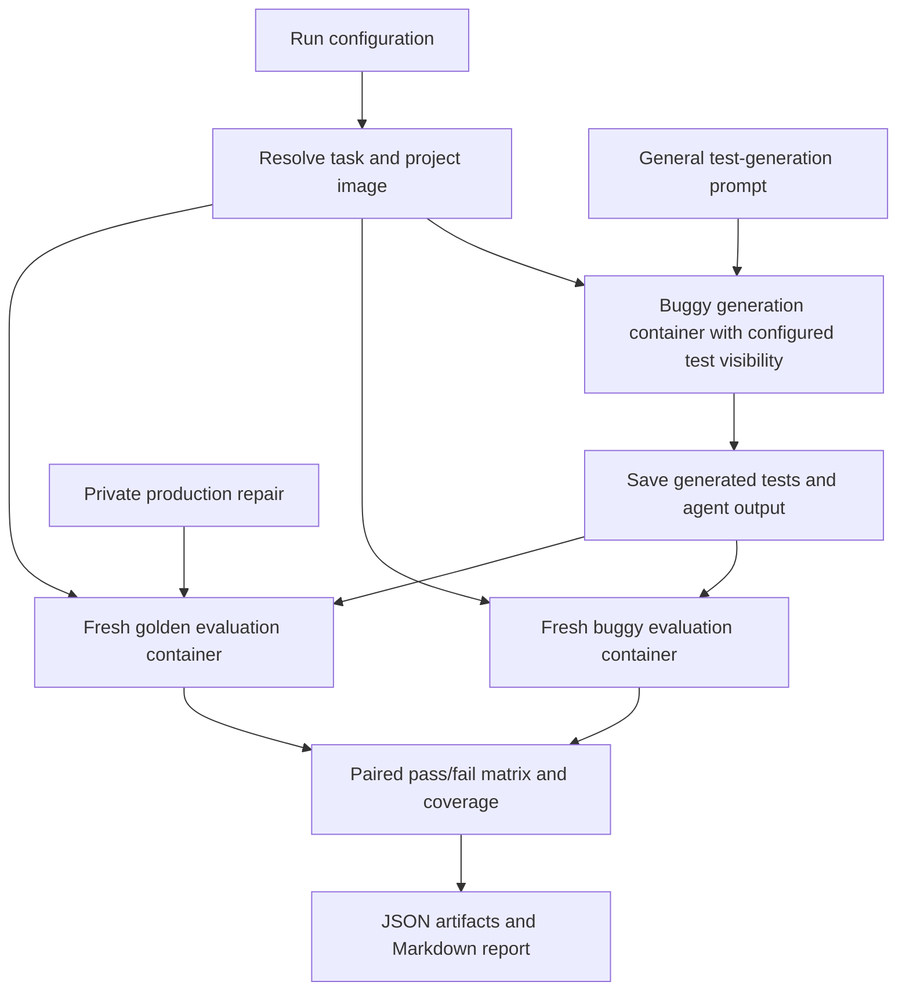

# Oracle Bench implementation plan

The current container and configuration cleanup is planned in
[container-revision-plan.md](container-revision-plan.md). That revision keeps
Stage 1 scope and adopts the Docker Python SDK, checked-in Dockerfiles, and a
smaller, more readable application interface.

This plan incorporates the notes at the end of [spec.md](spec.md). It supersedes the sequencing proposed in [spec-feedback.md](spec-feedback.md), which remains useful background. No benchmark code is implemented by this document.

The first milestone is a complete run: give an agent a buggy repository, ask it to generate tests, run its tests against buggy and golden code, and save coverage plus the pass/fail matrix. Existing tests can be kept or hidden as an experimental setting. Then run more instances, inspect the failures, and decide what deserves deeper investigation.

## Working decisions

- The primary task is repository-wide test generation. Do not expose the issue description or identify the affected function.
- Existing tests can be kept or hidden; neither condition is mandatory. Stage 1 defaults to keeping them and supports explicit removal paths for the hidden condition. Keep ordinary project documentation and examples.
- Start with SWE-bench/SWT-Bench task data and reusable repository environments, one harness, and one model.
- Select initial instances for practical execution support, without requiring manual bug classification or specification review.
- Keep the initial metrics close to the spec: the four paired pass/fail outcomes and line coverage.
- Perform bug classification and targeted experiments after observing results.
- Save ordinary harness traces now. Dedicated internet-use checks, thorough history sanitization, and discarded-test reconstruction come later.
- Use fresh evaluation containers so the measured code versions are controlled, even if the agent changes its generation workspace.

The initial results are exploratory. Record known limitations rather than making publication-grade validation a prerequisite for getting signal.

## Stage 1 — One complete end-to-end run

**Outcome:** one command launches an agent on a real repository and writes an inspectable result directory containing its tests, the paired outcomes, and coverage.

### Scope

Support one Python repository with a straightforward pytest invocation and one known buggy/golden pair. Choose the concrete instance during the initial environment check. Use a single harness with a noninteractive launch mode; its identity and model are configuration choices to settle when implementation begins.

No model comparison, targeted prompt, manual taxonomy, distributed scheduling, or generalized plugin system is needed in this stage.

### Components

Use a small Python package with these responsibilities. Initially these can be modules and concrete data classes; introduce formal plugin interfaces only when a second implementation needs them.

| Module                         | Initial responsibility                                                                    |
| ------------------------------ | ----------------------------------------------------------------------------------------- |
| `config.py`                    | Read and validate a single-run YAML configuration                                         |
| `datasets/swebench.py`         | Resolve one task into a repository snapshot, repair patch, and environment settings       |
| `containers.py`                | Prepare/reuse the project image, start containers, run commands, copy artifacts, clean up |
| `harnesses/<first_harness>.py` | Install and launch the selected agent and save its output                                 |
| `artifacts.py`                 | Capture generated test files and the complete workspace diff                              |
| `runners/pytest.py`            | Run generated tests and normalize outcomes and line coverage                              |
| `evaluate.py`                  | Evaluate the same test artifact on both versions and join results by test ID              |
| `run.py`                       | Execute the steps in order and persist stage status                                       |
| `report.py`                    | Produce JSON results and a short Markdown report                                          |

Inspect and pin a concrete upstream revision before integrating SWE-bench environment tooling. Reuse its environment preparation where practical; use SWT-Bench's paired execution behavior as a reference. Keep our orchestration and result format independent of upstream repair scoring. Do not assume current SWE-bench and SWT-Bench internals are interchangeable.

### Minimum data contracts

`Instance` contains the source task ID, repository identity, base revision, and
private golden repair and reference-test patches. The source adapter separately
resolves the image, source roots, test-path removal rules, and runner settings.
Preserve the original source metadata on the host for later analysis.

The input `RunConfig` contains the source and agent selectors, prompt path,
experimental limits, and output location. The source adapter expands it into a
saved schema-versioned configuration containing the repository runtime and
internally pinned evaluator toolchain. Credentials are inferred from the selected
agent/provider and excluded from saved configuration.

`GeneratedTests` contains a frozen bundle of allowed test files and fixtures, its content hash, and the full workspace diff for inspection. Capture untracked files as well as tracked changes.

`VersionResult` contains test IDs, outcomes, failure details, command exit status, line coverage, and raw log paths. `PairedResult` joins both version results and contains the matrix counts plus unmatched and non-binary outcomes.

### Repository preparation

1. Resolve the base snapshot and build or obtain its project environment.
2. Have the source adapter identify existing test paths using repository-specific
   rules. Remove them only when `existing_tests: hide` is selected; do not use a
   universal filename heuristic to delete arbitrary project files.
3. Preserve build/runtime assets needed by the project. If removing tests breaks installation, adjust the preparation order or choose another initial instance. Do not turn the first stage into general fixture extraction.
4. Keep the reference issue, golden repair, and developer regression tests on the host.
5. Prepare both evaluation branches from the same working-tree preparation rules. Apply the production repair only to the golden branch.

The initial test-removal policy concerns visible working-tree files. A complete Git-object/history audit is deferred, as requested. Record this limitation because removed tests could remain recoverable from history.

### Generation and evaluation flow



The agent and project environment live in the same generation container. Install the harness runtime separately from the project's Python environment where necessary. Start the agent programmatically with a prompt file, working directory, model configuration, and timeout.

The first prompt should be deliberately ordinary, along the lines of:

> Generate unit tests for this repository. Put the tests in the designated test directory. Do not modify the application code.

Provide the configured test location and environment activation instructions as operational context. Do not mention a hidden bug, the golden version, or a requirement that every test pass. Save the exact prompt and harness configuration, including any accessible default instructions.

Freeze the final generated tests when the agent exits or reaches its time limit. Save source edits and other unexpected changes for inspection, but only copy allowed test artifacts into evaluation. Flag submissions with forbidden changes; do not silently present them as ordinary compliant runs. Evaluation of the captured tests can still be retained as diagnostic output.

Run the identical test artifact in fresh buggy and golden containers. Both use the same project environment and test-removal policy. Reinstall or rebuild the package after applying the repair when required, and check that imports resolve to the intended checkout.

### Results

Use these plain labels throughout configuration, JSON, and reports:

| Buggy result | Golden result | Report label                  |
| ------------ | ------------- | ----------------------------- |
| Pass         | Pass          | Pass on both                  |
| Fail         | Pass          | Fail on buggy, pass on golden |
| Pass         | Fail          | Pass on buggy, fail on golden |
| Fail         | Fail          | Fail on both                  |

Store counts and individual test IDs. Pass on both means the test did not distinguish the pair; it does not by itself prove an incorrect expected value.

Keep skips, expected failures, collection/setup errors, crashes, timeouts, and unmatched test IDs separate. A failed container command must not automatically become a failed test. Empty output must not count as all tests passing.

Use pytest's structured results and capture enough phase information to distinguish execution failures from setup/collection problems. Collect generated-test line coverage over configured production source roots, separately for each version. Record covered and executable line counts, not just percentages. If coverage collection fails, retain the test results and record coverage as unavailable.

### Artifacts and CLI

Proposed commands:

```text
oracle-bench run configs/smoke.yaml
oracle-bench evaluate runs/<run-id>
oracle-bench report runs/<run-id>
```

`evaluate` reruns saved tests without invoking the model. `report` reads saved results without executing anything.

```text
runs/<run-id>/
  config.resolved.yaml
  instance.json
  prompt.txt
  status.json
  agent/
    stdout.log
    stderr.log
    trace.jsonl             # when the harness provides it
    workspace.diff
  generated/
    manifest.json
    tests/
  buggy/
    tests.json
    coverage.json
    output.log
  golden/
    tests.json
    coverage.json
    output.log
  results.json
  report.md
```

The run directory is host-owned and is not mounted wholesale into the generation container. Save durations and token/cost usage when exposed by the harness; use unavailable values when it does not expose them.

### Minimum checks and completion criterion

Use one private developer regression test to check the chosen pair once, before spending on the first agent run. This is a smoke check of the plumbing, not a manually reviewed eligibility campaign.

Check the evaluator with tiny controlled tests for the four matrix cells, empty output, and collection failure. Confirm a saved generated artifact can be evaluated again without calling the model.

**Stage complete when:** a real agent run finishes through the entire pipeline, its generated tests and logs are inspectable, and the report shows the matrix and coverage or explicit execution errors. Finding the hidden bug is not required for pipeline completion.

## Stage 2 — Small batch MVP and initial signal

**Outcome:** run a modest batch across several repositories and inspect where the agent succeeds or struggles.

Start with roughly 10–20 instances as an adjustable engineering sample, using the same harness/model/prompt. Add repository environment and runner support as encountered. Avoid selecting instances based on whether the agent detects their bugs.

### Additions

- YAML selection by dataset, repository, explicit instance IDs, and maximum instance count.
- Sequential batch execution by default, with individual instance failures isolated from the rest of the batch.
- A persisted resolved job list so rerunning does not silently select different tasks.
- Resume by stage: reuse captured tests if generation completed; rerun evaluation if it failed.
- Small configurable concurrency, maximum attempts, per-agent time limits, and provider spending limits where available.
- Reuse project images across attempts; delete completed containers while retaining compact artifacts.
- CSV/JSON batch summaries and a Markdown table linking each instance's report.
- A generic failure record for unsupported repositories, setup failures, and test-runner failures, retaining these in attempted-run totals.

Avoid a database initially if per-job status files suffice. Introduce SQLite when job claiming or concurrent updates actually require it.

The report should show the four matrix counts per instance, the number of instances with at least one test that fails on buggy and passes on golden, coverage, execution problems, and available usage information. Preserve instance-level results so large generated suites do not dominate comparisons.

**Stage complete when:** we can launch a small batch, resume an interrupted run without regenerating completed tests, and inspect examples of missed bugs, distinguishing tests, and execution trouble.

This is the main initial-signal milestone. Review results here before choosing the next investment; later stages can be reordered based on what limits useful runs.

## Stage 3 — Experiment matrix and coverage variants

**Outcome:** compare prompts, models, and harnesses with the same instance set and clear provenance.

### Additions

- Expand configuration into instance × harness × model × prompt × repeat jobs.
- Add a second harness adapter and formalize the shared adapter contract from the two actual integrations.
- Record model identifiers, harness versions, sampling settings, prompt hashes, image digests, and artifact hashes.
- Display planned job counts before execution and enforce concurrency and budget reservations where usage reporting supports them.
- Distinguish a fresh model attempt from an infrastructure retry. Never automatically regenerate tests because their score is poor.
- Group reports by experiment setting while retaining per-instance paired results.
- Add branch coverage, affected-module/function coverage, and changed-line coverage as separately named options.

Changed-line coverage uses the private repair only during evaluation. Report denominators per version because added and deleted lines do not have symmetric counterparts. Baseline-suite coverage and incremental coverage can be added as evaluator-only diagnostics; the agent receives the configured test-visibility condition.

**Stage complete when:** two experiment settings can be compared on a frozen instance list, with repeat identity, coverage definitions, and resource usage recorded clearly.

## Stage 4 — More repositories and datasets

**Outcome:** extend the pipeline beyond SWE-derived tasks without changing its core generation/evaluation flow.

First add an explicit repository-pair manifest:

- Repository URL or local source.
- Buggy and golden commit references, resolved to immutable revisions.
- Environment/image recipe and install/rebuild commands.
- Existing-test removal rules and allowed generated-test locations.
- Test command, result parser, and coverage source roots.

Then inspect and adapt additional datasets from the spec, prioritizing those that provide usable buggy/golden pairs and environments. Audit each dataset when implementing its adapter, rather than auditing every source before the MVP.

Keep source provenance and optional capabilities in the normalized record. Datasets without pairs can produce coverage and single-version outcomes; paired matrix fields remain unavailable. Preserve dataset-specific preprocessing choices so later comparisons to the original papers are interpretable.

Track overlapping repository snapshots/bugs across datasets as they are imported. Add Java or other language runners only when a selected dataset requires them.

**Stage complete when:** an arbitrary repository pair and at least one additional dataset can use the existing harness and report pipeline through adapters.

## Stage 5 — Analyze observed failures and run targeted studies

**Outcome:** explain patterns found in broad runs and test specific hypotheses.

### Additions

- Attach post-hoc annotations to instance IDs and run IDs without modifying original results.
- Classify interesting failures by bug type, triggering input, expected behavior, apparent assertion choice, and available specification evidence.
- Sample successful cases as well as failures to avoid drawing conclusions only from misses.
- Add targeted module/function prompts for the particular scenarios identified in the data.
- Add issue-provided controls when useful for comparison with SWT-style tasks.
- Support comparisons of existing-tests-visible versus existing-tests-absent conditions if the initial results motivate that question.
- Repeat selected runs and differential tests to assess stability.

No taxonomy or targeted condition is required before Stage 2. Raw matrices remain the source results; annotations provide interpretation rather than retroactively rewriting them.

**Stage complete when:** we can trace a claimed weakness from broad-run results to inspected examples and a controlled follow-up experiment.

## Stage 6 — Stronger validity checks and research-release preparation

**Outcome:** improve confidence and reproducibility once the benchmark produces useful signal.

### Additions

- Inspect network/tool traces for upstream repository, issue, or repair retrieval. Distinguish ordinary documentation use from task-specific solution access and retain evidence for review.
- Add network observability or restrictions where ordinary harness traces leave gaps. Absence of a trace match is not proof that no retrieval occurred.
- Sanitize Git history, objects, caches, and other workspace paths that could reveal withheld tests or repairs.
- Expand automatic reference-pair checks and record exclusions and their causes consistently.
- Add stronger artifact checks, flaky-test handling, cross-version test identity handling, and stable result-schema versioning.
- Freeze dataset manifests and environments for reproducible study runs; document remaining contamination and setup limitations.
- Add uncertainty estimates and release-oriented reports when running comparisons large enough to support them.

Keep these concerns visible as limitations in earlier runs, but do not implement this whole stage before obtaining initial signal.

## Deferred without a scheduled stage

- Reconstructing discarded tests and evaluating intermediate assertions.
- Distributed workers, cloud orchestration, and a hosted leaderboard.
- Automatic semantic bug classification before execution.
- A universal environment builder for arbitrary languages and projects.

These may become worthwhile later. None is needed to answer the first practical question: when an agent is simply asked to generate tests for a real repository, what do those tests do on buggy and golden code?
