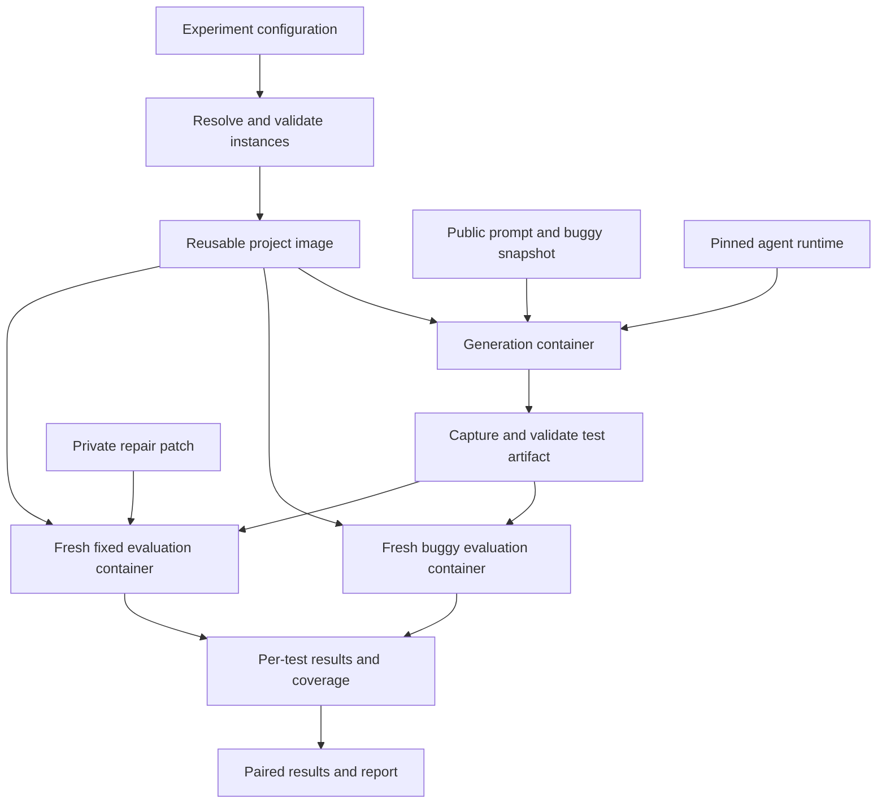

# Oracle Bench: design feedback and implementation plan

I’d build Oracle Bench as a **paired-version test-generation benchmark**, borrowing repository environments from SWE-bench and using SWT-Bench as the reference for differential evaluation. The first implementation should prove the experiment on a handful of real bugs before generalizing to more datasets.

The biggest design decision is separating **finding relevant behavior to test** from **choosing the correct expected behavior**. Without that separation, a low bug-detection rate could tell us very little about the oracle problem.

This plan is based on the project spec, the SWE-bench harness documentation and current evaluation code, and SWT-Bench’s paper and implementation. It is a design proposal, not an implemented pipeline.

## What we can reuse

SWE-bench provides repository snapshots, repair patches, reference test patches, and repository-specific execution environments. Its documented image hierarchy separates base, environment, and instance layers, allowing substantial reuse across tasks. Its normal evaluator applies a proposed repair and checks reference tests. [SWE-bench harness documentation](https://www.swebench.com/SWE-bench/reference/harness/)

SWT-Bench changes the generated artifact to tests: given a repository and issue description, the agent should produce tests that fail before the repair and pass afterward. It also measures coverage of code affected by the repair. That is very close to our evaluation problem; the major change is what information the agent receives. [SWT-Bench paper](https://proceedings.nips.cc/paper_files/paper/2024/file/94f093b41fc2666376fb1f667fe282f3-Paper-Conference.pdf)

SWT-Bench supports both integrated unit tests and standalone reproduction scripts. I’d start with unit tests, since reproduction scripts introduce a different output contract and weaker test-level reporting. Its published dataset variants also contain preconstructed prompts and retrieved context, so we should construct our own agent inputs from underlying task records. [SWT-Bench repository](https://github.com/logic-star-ai/swt-bench)

One implementation gotcha already surfaced: current SWE-bench source uses different module locations and task/image interfaces from some indexed documentation. We should pin an exact upstream revision, then put all integration behind an adapter. Copying snippets from different versions will be fragile. [Current SWE-bench evaluator](https://github.com/SWE-bench/SWE-bench/blob/main/swebench/harness/run_evaluation.py)

## Define three experimental conditions

I’d support these conditions explicitly, with separate results:

| Condition                     | What the agent receives                             | What it measures                                            |
| ----------------------------- | --------------------------------------------------- | ----------------------------------------------------------- |
| Repository-wide, issue hidden | Buggy repository and general test-generation prompt | Exploration, test selection, and oracle generation together |
| Targeted, issue hidden        | Buggy repository and a named module or function     | Oracle generation with reduced search burden                |
| Issue provided                | Buggy repository and original issue description     | An SWT-style control                                        |

Your repository-wide condition should remain the main realistic task. The targeted condition is useful for understanding _why_ agents fail.

If an agent spends its budget testing a completely different subsystem, that is an end-to-end miss, but weak evidence of an oracle problem. If it tests the affected function and asserts the buggy result, the evidence is much stronger.

A target selected from the repair patch does leak localization information. That is acceptable as an explicitly labeled experimental condition; it should never silently enter the repository-wide prompt.

There is another complication: some desired behavior cannot be inferred from the buggy repository. An issue might introduce a new policy or clarify an ambiguous contract. Those cases measure missing specification as well as oracle generation.

For the pilot, I’d annotate each instance with:

- Whether intended behavior is supported by existing docs, docstrings, tests, or a recognizable invariant.
- Whether the change repairs existing behavior or adds a feature.
- Whether the repair includes unrelated changes.
- Whether reproducing the issue requires special infrastructure or external services.

SWE-bench Verified is a useful candidate pool, but its validation focused on repair tasks with issue descriptions. It does not establish suitability for issue-hidden test generation. [SWE-bench Verified announcement](https://openai.com/index/introducing-swe-bench-verified/)

## Construct the version pair carefully

For SWE-derived tasks, the normalized pair should be:

```text
buggy = base repository snapshot
fixed = same snapshot + reference production-code repair
```

The developer’s reference test patch stays separate. We use it privately to establish that the pair is valid; we do not include it in the agent workspace or count its coverage as generated coverage.

I would call the second version `fixed` internally. “Golden” suggests that the whole repository is correct, whereas we only have evidence about a particular repair.

Both evaluation branches should contain the same baseline tests and the same generated artifact. The intended production repair should be the only relevant difference. Any necessary build or dependency differences must be recorded.

For arbitrary repositories, two commits are sufficient to describe a candidate pair, but not necessarily a valid benchmark instance. A large commit range may contain several behavioral changes. The adapter must also specify installation, test execution, and a private witness demonstrating the intended fail/pass transition.

## Use one container during generation, then fresh containers for evaluation

Your proposed co-location is reasonable: the agent, repository, and project environment can live together while tests are generated.

I would still evaluate the final tests in fresh containers:



This prevents installation changes, source edits, monkeypatches left on disk, or other agent workspace state from becoming part of the evaluated program.

It does **not** require three independently built images per attempt. The containers can share the same project image and use temporary writable layers. The fixed branch applies the repair and rebuilds the project when necessary.

The host orchestrator owns the private metadata, lifecycle, budgets, artifact extraction, and scoring. The agent receives only its public task and generation environment.

## Keep private evaluation information physically out of the generation environment

Removing the issue from the prompt is insufficient if the answer remains discoverable elsewhere.

The generation workspace should exclude:

- Repair and reference test patches.
- Issue descriptions and private target metadata.
- Future Git objects, tags, reflogs, or alternate object stores.
- Evaluation scripts or logs containing the repair.
- Shared workspaces or memory from other attempts.

I’d materialize a source snapshot and initialize a fresh local Git repository so the agent can still use diffs normally. Removing a remote alone does not remove already downloaded history.

Retain documentation and tests present in the base snapshot; those are legitimate sources of intended behavior. Record the exact visibility policy.

For the initial controlled benchmark, allow model API access through restricted egress, but disable general web access and repository fetching during generation. Otherwise the agent can recover the issue or repair online. No Docker socket or host credentials should be mounted into the task container.

These controls limit retrieval leakage. They cannot eliminate memorization of public benchmark tasks.

## Build a small set of explicit interfaces

I’d use Python for the orchestrator, typed configuration models, YAML experiment files, SQLite for local job state, and ordinary files for artifacts. We do not need a distributed scheduler initially.

| Component           | Responsibility                                                |
| ------------------- | ------------------------------------------------------------- |
| Dataset adapter     | Convert source records into normalized instances              |
| Environment backend | Prepare images and materialize repository versions            |
| Harness adapter     | Install and launch an agent; collect traces and usage         |
| Artifact validator  | Capture test changes and enforce submission rules             |
| Test-runner adapter | Discover tests, execute them, normalize results and coverage  |
| Evaluator           | Pair outcomes and calculate metrics                           |
| Experiment runner   | Expand configurations, schedule jobs, enforce budgets, resume |

The normalized instance should have separate public and private representations. Do not pass a full record to a harness and trust prompt formatting to hide fields.

The private record needs repository identity, snapshot hashes, repair artifact, reference tests, environment recipe, runner settings, provenance, and capability flags. Capabilities might include `paired_versions`, `reference_tests`, `line_coverage`, and `branch_coverage`.

That lets a later dataset without version pairs participate in coverage evaluation while reporting differential metrics as unavailable.

The harness adapter should launch a pinned command with a prompt file, working directory, resource limits, and output directory. Its result includes exit status, transcript, usage, and timestamps. **The authoritative submission comes from the resulting filesystem changes**, not from code blocks in the final response.

## Make the artifact contract narrow initially

For the first version, permit new test files and declared fixture files in approved locations. Retain existing tests for reference and fixture reuse, but do not allow the submission to change production code, dependencies, test-runner configuration, or existing assertions.

Record the complete workspace diff, including untracked files, even when the submission violates policy. Do not silently discard forbidden changes and present the remainder as a normal successful submission.

Later, support additions to existing test files. That is useful for repository conventions, but requires more careful accounting to distinguish generated tests from baseline tests.

The same accepted artifact must apply to both versions without editing or “repairing” it between runs. Patch application problems receive their own status.

The evaluator chooses the test command using the repository adapter. The agent’s suggested command can be recorded as supporting information.

## Validate instances before model spending

For each candidate instance:

1. Resolve immutable dataset, repository, environment, and upstream-tool versions.
2. Prepare the project image.
3. Materialize buggy and fixed versions in clean environments.
4. Run the private reference tests on both and verify the expected differential.
5. Check relevant baseline tests and record preexisting failures.
6. Audit the public snapshot for hidden evaluation artifacts.
7. Admit the instance to a versioned eligible manifest, or record an exclusion reason.

For each model attempt:

1. Start a fresh generation container.
2. Launch the harness with the public prompt and budget.
3. Capture traces, usage, intermediate edits where available, and final workspace changes.
4. Validate and freeze the test artifact.
5. Discover and run generated tests independently on buggy and fixed versions.
6. Collect test outcomes, failure phases, logs, and coverage.
7. Repeat apparent differential results to check stability.
8. Persist results and remove temporary containers.

Rebuilding matters for compiled extensions and generated code. Applying a source patch is not enough if imports still load an old installed wheel. Each adapter should verify where the tested package is being imported from.

## Use the four-cell outcome table, but avoid treating it as simple accuracy

Your proposed matrix is useful:

| Buggy | Fixed | Interpretation                              |
| ----- | ----- | ------------------------------------------- |
| Fail  | Pass  | Candidate detection of the repaired bug     |
| Pass  | Fail  | Candidate assertion encoding buggy behavior |
| Pass  | Pass  | No distinction between these versions       |
| Fail  | Fail  | Failure unresolved by this repair           |

The important qualification is that **pass/pass does not establish an incorrect oracle**. A test may correctly cover unaffected behavior, miss the triggering input, or execute the changed code without exposing the difference.

Pass/fail is stronger evidence of an oracle aligned with buggy behavior, although it still requires checking for incidental incompatibilities.

Likewise, fail/fail is not automatically an invalid test. It might reveal a different real bug that remains in the fixed version.

Keep these outcomes outside the binary matrix:

```text
skip, xfail, xpass, collection_error, setup_error,
timeout, crash, not_collected, infrastructure_error
```

Preserve the original failure phase and exception. A genuine behavioral bug can produce an unexpected exception, so “only assertion failures count” would be too restrictive. Infrastructure failures should never become bug-detection credit automatically.

Test identities must match across branches. Differences in collected parameter cases should be reported explicitly, not inferred as passing or failing tests.

I’d report these metrics first:

- **Detection rate:** fraction of eligible attempts with at least one stable, admissible fail/pass test.
- **Clean detection rate:** detection plus all generated tests passing on the fixed version, with skips and expected failures reported separately.
- **Reverse differential rate:** frequency of pass/fail tests.
- **Submission validity and execution rates:** whether agents produce runnable, policy-compliant tests.
- **Four-cell counts:** both per test and per instance.
- **Cost and time:** per attempt and per detected instance.

Use instance-level detection as the headline. A model that generates hundreds of redundant assertions should not dominate one that generates a single effective test.

Infrastructure failures remain visible in attempted-run accounting. Eligibility exclusions should be established before examining model performance.

## Coverage needs two views

Collect coverage from generated tests separately from the existing suite.

I’d start with:

- Line coverage over the declared source scope.
- Coverage of affected functions or modules.
- Coverage of executable changed lines, separately for buggy and fixed versions.
- Incremental coverage beyond baseline tests, when that baseline is affordable.

Branch coverage can follow where the runner supports it reliably.

Whole-repository coverage will often be tiny for a successful targeted test. Conversely, high coverage can coexist with weak assertions. Report coverage alongside differential behavior, without combining them into one score.

Added lines have no buggy-version counterpart, and deleted lines have no fixed-version counterpart. Store the denominators explicitly and use unavailable values where appropriate.

For the MVP, aggregate coverage is enough. Per-test coverage becomes useful later for asking whether an individual passing test actually reached the affected area.

## Capture evidence of agents weakening their own tests

This is particularly valuable for your hypothesis.

When the harness exposes tool activity, preserve test-file snapshots around test execution. That can reveal sequences such as:

```text
agent writes assertion
→ assertion fails on buggy code
→ agent changes expected value
→ test passes
```

After generation ends, we can privately evaluate those intermediate test versions against the fixed code. A discarded test that would have produced fail/pass, followed by a final test that produces pass/fail, is much more informative than a final pass/pass count.

Some harnesses will not expose enough information. Mark trace completeness and keep the main evaluation independent of this feature.

For qualitative analysis, annotate examples as missed target, missed triggering input, weak assertion, observed-output copying, assertion weakening, ambiguous specification, environment trouble, or unrelated bug candidate. Do not infer “purposefully made everything pass” from outcomes alone.

## Make experiments resumable and budgeted

An illustrative configuration could look like this:

```yaml
dataset:
  adapter: swebench
  source: princeton-nlp/SWE-bench_Verified
  revision: "<pinned revision>"
  manifest: manifests/pilot.jsonl

task:
  condition: repository_blind
  prompt: prompts/unit_tests_v1.md
  artifact_policy: new_test_files

matrix:
  harnesses: [harness_a]
  models: [model_a]
  repeats: 1

limits:
  max_concurrent_agents: 1
  agent_wall_seconds: 900
  evaluation_wall_seconds: 600
  max_model_spend_usd: 20

evaluation:
  versions: [buggy, fixed]
  coverage: line
  differential_rechecks: 2
```

These are proposed field names and illustrative limits.

Before running, expand the matrix into an immutable job manifest and display the number of attempts. A job identity should include the instance, environment digest, harness version, model identifier, prompt hash, condition, sampling settings, and repeat index.

Persist stages so an evaluation crash does not require paying for generation again. Distinguish infrastructure retries from fresh model attempts.

For concurrent generation, reserve budget before launching jobs. Provider usage reporting can lag, so the runner should be candid about how strictly it can enforce a monetary ceiling.

Keep project images cached, remove completed containers by default, and retain compact artifacts. Schedule nearby jobs on already available images where possible. Harness runtimes should be isolated from old project dependencies, using separate virtual environments or runtime directories inside the same container.

## Expand datasets through capabilities, with an audit per adapter

I would implement SWE-derived pairs first, then an explicit arbitrary-repository manifest adapter.

BugsInPy is a promising next Python source because it provides faulty/fixed revisions, patches, and bug-exposing tests. Defects4J provides paired Java revisions and supporting infrastructure, but adds another runtime and build ecosystem. Its own documentation emphasizes environment-sensitive reproducibility. [BugsInPy paper](https://ratnadiraw.github.io/assets/pdf/bugsinpy.pdf), [Defects4J repository](https://github.com/rjust/defects4j)

For the remaining papers in your spec, I would defer suitability claims until inspecting their actual artifacts. Each audit should establish:

- Whether executable version pairs exist.
- What specification information the original experiment exposed.
- Whether repositories, fixtures, and environments can be reconstructed.
- Which preprocessing steps affect comparison with published results.
- Overlap with other datasets and redistribution constraints.

Dataset overlap deserves explicit tracking: a task derived from SWE-bench should not count as independent evidence simply because it appears under another benchmark name.

Synthetic cases remain useful as evaluator fixtures and controlled studies, even if they turn out to be too easy for the main benchmark.

## Build in four increments

| Increment             | Deliverable                        | Completion criterion                                                                              |
| --------------------- | ---------------------------------- | ------------------------------------------------------------------------------------------------- |
| Pair evaluation       | One real instance; no agent        | Reference test reproduces the bug; outcome parser handles positive, reverse, and invalid examples |
| End-to-end generation | One harness and one model          | Tests are captured and evaluated on both versions with reproducible artifacts                     |
| Diagnostic pilot      | Roughly 5–10 curated instances     | Run repository-wide, targeted, and issue-provided conditions; inspect traces                      |
| Small study           | Larger frozen manifest and repeats | Compare conditions and harnesses with cost accounting and per-instance uncertainty                |

Before broadening the pilot, I’d require that rerunning evaluation on a saved artifact produces the same result, hidden artifacts are absent from generation, and the score cannot be earned merely by changing production code or failing test collection.

The decision I’d most like to settle with you is whether **repository-wide generation is the primary benchmark, with targeted generation as a diagnostic companion**. That preserves your realistic task while giving us a way to tell whether poor performance comes from exploration or from the oracle itself.
